# SIMULADOR VETERINÁRIO GAMIFICADO PARA ENSINO DE EQUILÍBRIO ÁCIDO-BASE EM PEQUENOS ANIMAIS

## INTRODUÇÃO

A Revolução Industrial 4.0 tem transformado significativamente o cenário educacional, integrando tecnologias digitais aos processos de ensino-aprendizagem. Na medicina veterinária, os distúrbios do equilíbrio ácido-base representam um dos desafios mais complexos no intensivismo, envolvendo conceitos intrincados como pH sanguíneo, bicarbonato, pCO₂ e anion gap. Estes distúrbios exigem tomada de decisões clínicas rápidas e precisas, especialmente em pacientes críticos, constituindo um obstáculo significativo para estudantes e profissionais recém-formados.

A aprendizagem móvel (m-learning) emerge como alternativa promissora, aproveitando a ubiquidade dos dispositivos móveis – com 81,43% dos brasileiros utilizando Android – para transformar smartphones em ferramentas educacionais efetivas. A gamificação, estratégia que incorpora elementos de jogos em contextos não lúdicos, demonstra potencial para aumentar o engajamento, promover aprendizagem ativa e facilitar a aplicação prática de conhecimentos teóricos complexos. Neste contexto, o desenvolvimento de ferramentas digitais interativas que simulem situações clínicas reais torna-se fundamental para preparar adequadamente os futuros profissionais da medicina veterinária intensivista.

## OBJETIVO

Desenvolver e validar um software educacional gamificado, em modalidade m-learning acessível via navegadores web em dispositivos móveis, voltado ao treinamento de estudantes e profissionais da clínica médica veterinária de pequenos animais, focando especificamente na identificação e tratamento de distúrbios do equilíbrio ácido-base em cães e gatos, através de simulações clínicas interativas que promovam aprendizagem ativa e tomada de decisão em tempo real.

## MATERIAL E MÉTODOS

O simulador foi desenvolvido utilizando tecnologias web modernas (React, TypeScript, Tailwind CSS) com integração a banco de dados Supabase para persistência de dados e gerenciamento de usuários. A arquitetura contempla dois perfis: professores e estudantes, com funcionalidades específicas para cada categoria.

O sistema implementa casos clínicos customizáveis contendo parâmetros fisiológicos monitorados em tempo real (frequência cardíaca, frequência respiratória, temperatura, pH sanguíneo, pCO₂, HCO₃, entre outros). A mecânica gamificada inclui sistema de pontos de vida (HP) que decresce gradualmente, simulando a deterioração do paciente crítico, exigindo intervenções terapêuticas adequadas dentro de janelas temporais específicas.

Os estudantes aplicam tratamentos selecionando medicações e procedimentos, recebendo feedback imediato sobre suas decisões. O algoritmo de simulação registra todas as ações em banco de dados (session_history, session_decisions, session_treatments) para análise posterior. Sistema de badges reconhece conquistas específicas (diagnóstico preciso, estabilização rápida, uso eficiente de recursos) incentivando progressão.

Professores podem criar casos personalizados, acompanhar desempenho individual dos alunos através de relatórios detalhados, compartilhar casos via códigos de acesso e realizar análises comparativas entre sessões. O sistema incorpora inteligência artificial (Gemini/GPT) para geração de diagnósticos diferenciais, dicas contextualizadas e feedback personalizado.

A validação seguirá metodologia comparativa com 20 estudantes randomizados em dois grupos (n=10 cada): experimental (com acesso ao software) e controle (sem acesso), durante três semanas. Análise estatística utilizará teste t de Student (α=0,05) comparando médias de desempenho em avaliações convencionais sobre a temática, com processamento estatístico realizado no RStudio.

## RESULTADOS ESPERADOS

Espera-se desenvolver ferramenta educacional inovadora que melhore significativamente a competência clínica de estudantes e profissionais na identificação e manejo de distúrbios do equilíbrio ácido-base. A gamificação deverá promover maior engajamento e motivação discente, traduzindo-se em melhor retenção de conhecimento e habilidade de aplicação prática.

Prevê-se que o grupo experimental apresente desempenho superior nas avaliações, demonstrando eficácia da metodologia m-learning gamificada. A disponibilização de nova modalidade de aprendizado baseada em TIC contribuirá para fortalecimento das ações tecnológicas educacionais, democratizando acesso à educação continuada de qualidade independente de limitações geográficas ou temporais.

A plataforma possibilitará formação de repositório de casos clínicos estruturados, fomentando cultura de aprendizagem colaborativa e compartilhamento de conhecimento entre instituições. Espera-se obter registro de software, contribuindo para produção científica e tecnológica nacional em educação veterinária, além de despertar maior interesse discente por áreas críticas da medicina veterinária intensivista.

---

## EVIDÊNCIAS VISUAIS DO SOFTWARE

As capturas de tela das principais interfaces do VetBalance estão disponíveis no repositório do projeto:  
📁 [`docs/screenshots/`](https://github.com/KyoFaBraL/vet-sim-buddy/tree/main/docs/screenshots)

| Figura | Descrição |
|--------|-----------|
| 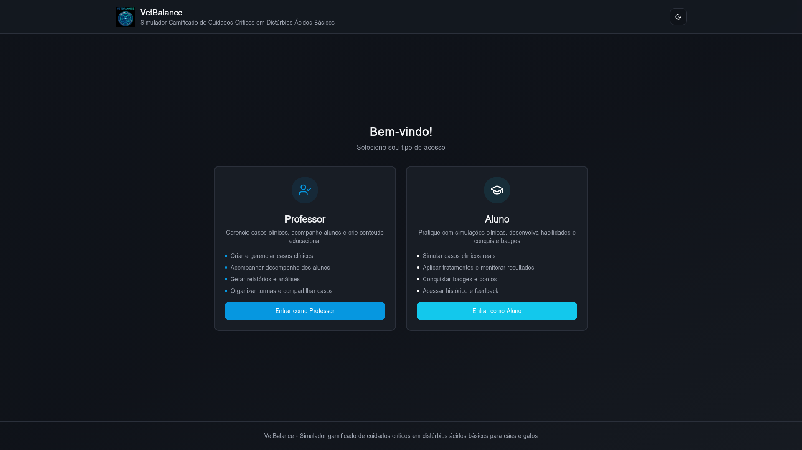 | **Figura 1** – Tela inicial de seleção de papel (Professor/Aluno) |
| 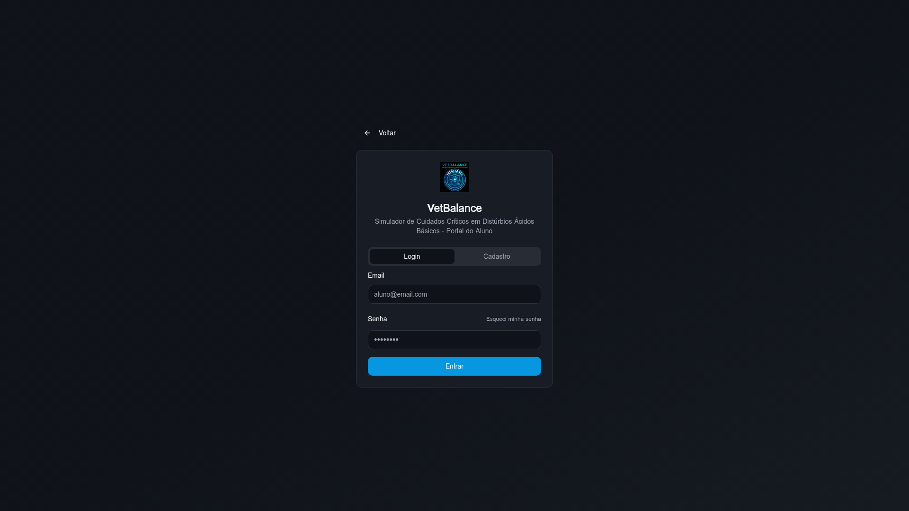 | **Figura 2** – Formulário de autenticação do aluno |
| 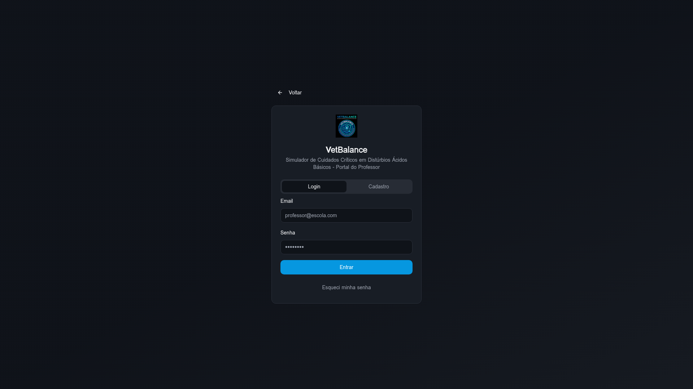 | **Figura 3** – Formulário de autenticação do professor com chave de acesso |
| 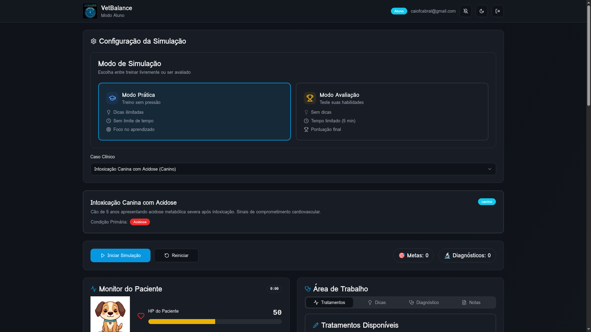 | **Figura 4** – Dashboard principal do simulador (interface do aluno) |
| 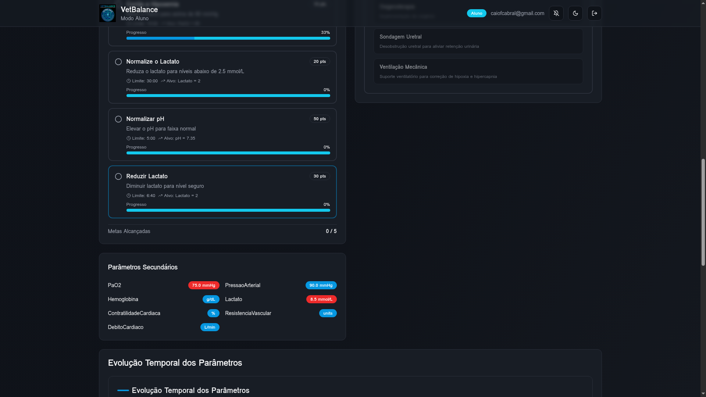 | **Figura 5** – Monitor de parâmetros fisiológicos em tempo real |
| 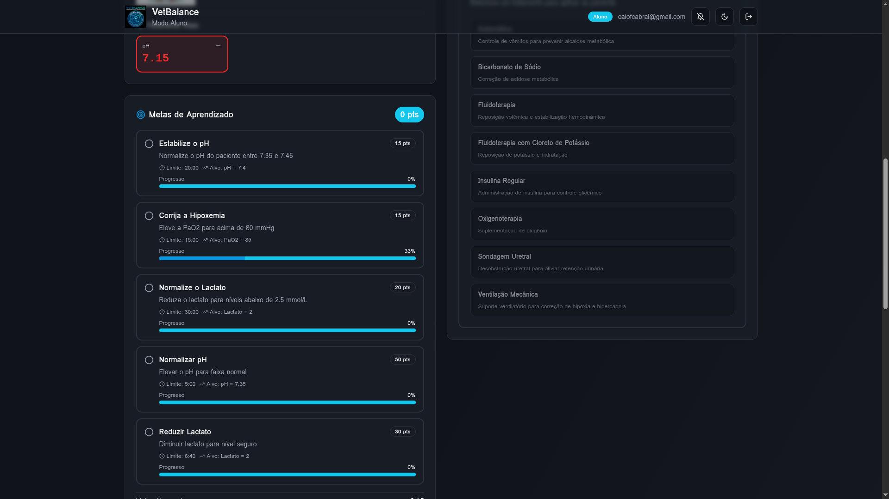 | **Figura 6** – Painel de seleção e aplicação de tratamentos |
| 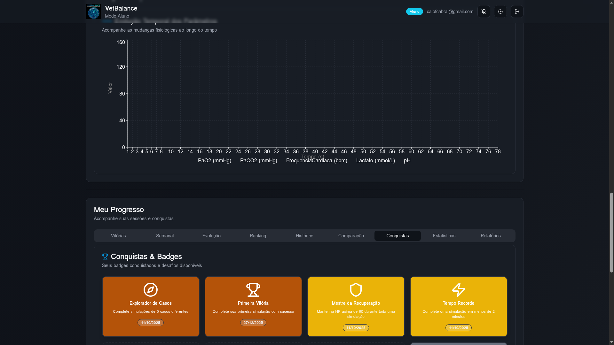 | **Figura 7** – Sistema de badges e conquistas gamificadas |
| 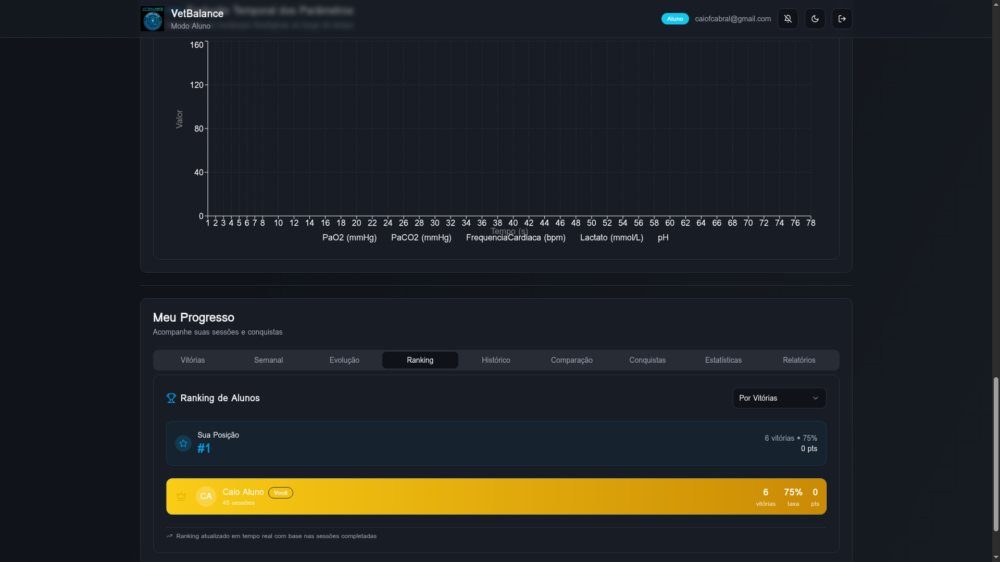 | **Figura 8** – Leaderboard com ranking semanal dos alunos |
| 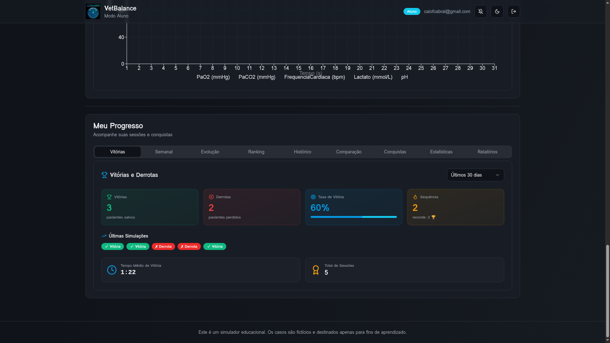 | **Figura 9** – Histórico de evolução no ranking ao longo das semanas |
| 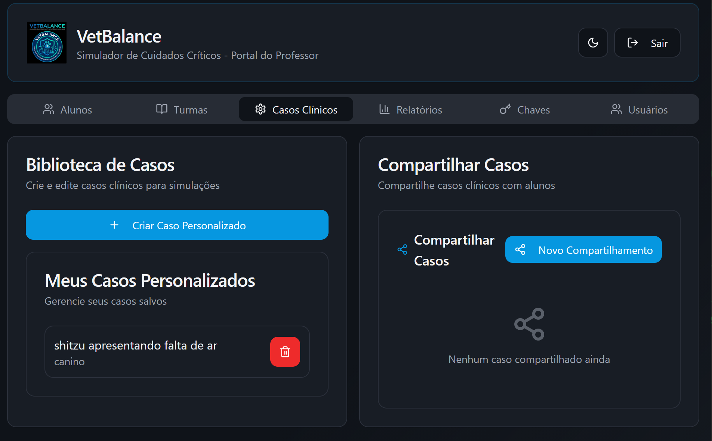 | **Figura 10** – Dashboard de gerenciamento do professor |
| 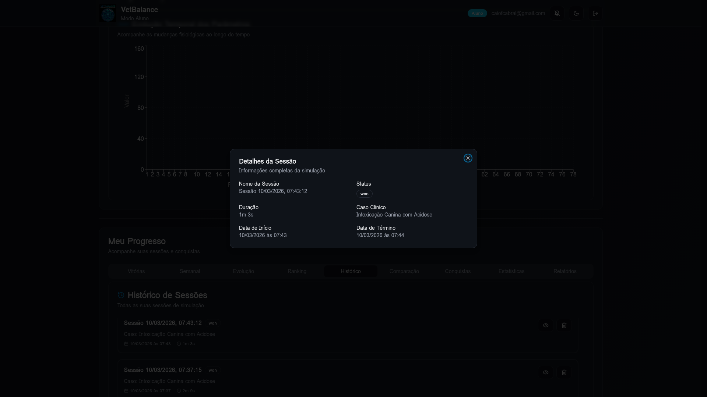 | **Figura 11** – Resultado de simulação: paciente estabilizado (vitória) |
| 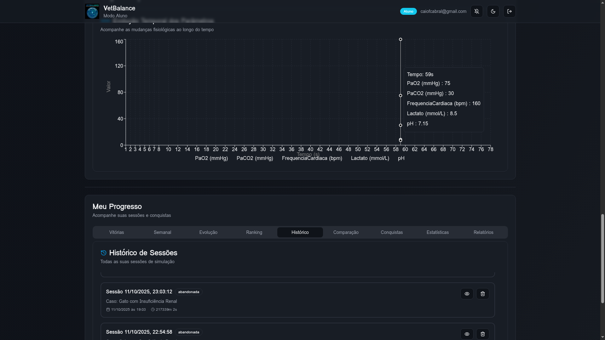 | **Figura 12** – Resultado de simulação: paciente faleceu (derrota) |

---

**Palavras-chave:** Gamificação. Ensino veterinário. M-learning. Equilíbrio ácido-base. Simulação clínica.
