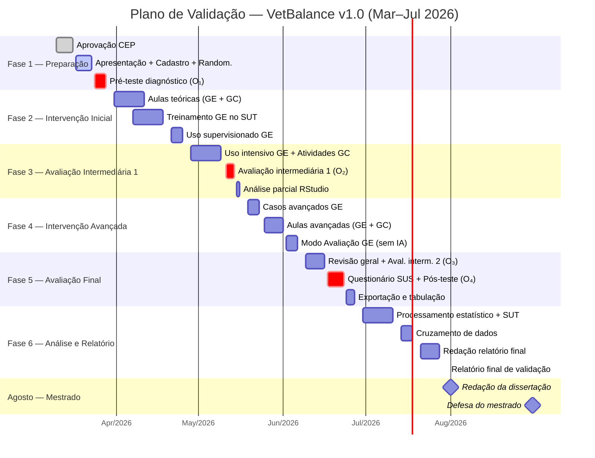

# PLANO DE VALIDAÇÃO DE SOFTWARE – VETBALANCE

**Identificador do Documento:** VETBALANCE-PVS-001  
**Versão:** 1.0  
**Data de Emissão:** 24 de fevereiro de 2026  
**Classificação:** Documento Técnico de Validação  
**Normas de Referência:** IEEE 829-2008 (Standard for Software Test Documentation), ISO/IEC 25010:2011 (Systems and software Quality Requirements and Evaluation — SQuaRE), NBR ISO/IEC 12207:2009 (Processos de Ciclo de Vida de Software)  
**URL do Software:** https://vetbalance.app.br

---

## SUMÁRIO

1. [Introdução](#1-introdução)
2. [Escopo da Validação](#2-escopo-da-validação)
3. [Referências Normativas](#3-referências-normativas)
4. [Definições e Terminologia](#4-definições-e-terminologia)
5. [Desenho Experimental](#5-desenho-experimental)
6. [Critérios de Aceitação](#6-critérios-de-aceitação)
7. [Ambiente de Teste](#7-ambiente-de-teste)
8. [Procedimentos de Teste](#8-procedimentos-de-teste)
9. [Cronograma de Execução](#9-cronograma-de-execução)
10. [Instrumentos de Coleta de Dados](#10-instrumentos-de-coleta-de-dados)
11. [Métricas de Qualidade de Software](#11-métricas-de-qualidade-de-software)
12. [Análise Estatística](#12-análise-estatística)
13. [Rastreabilidade de Dados](#13-rastreabilidade-de-dados)
14. [Gestão de Riscos](#14-gestão-de-riscos)
15. [Considerações Éticas](#15-considerações-éticas)
16. [Critérios de Encerramento](#16-critérios-de-encerramento)
17. [Aprovações](#17-aprovações)

---

## 1. INTRODUÇÃO

### 1.1 Propósito

Este documento estabelece o plano de validação do software educacional **VetBalance**, definindo os procedimentos, critérios e cronograma para avaliação da eficácia pedagógica do sistema como ferramenta de m-learning gamificada no ensino de equilíbrio ácido-base em medicina veterinária.

### 1.2 Objetivo da Validação

Verificar se o software atende aos requisitos de qualidade definidos pela ISO/IEC 25010 e se produz resultados pedagógicos mensuráveis e estatisticamente significativos quando utilizado como recurso complementar ao ensino presencial.

### 1.3 Escopo Temporal

| Item | Valor |
|------|-------|
| **Data de início** | 10/03/2026 |
| **Data de término** | 31/07/2026 |
| **Duração total** | ~5 meses (20 semanas) |
| **Agosto/2026** | Reservado para redação e defesa do mestrado |

---

## 2. ESCOPO DA VALIDAÇÃO

### 2.1 Item de Teste

| Atributo | Descrição |
|----------|-----------|
| **Nome do software** | VetBalance |
| **Versão** | 1.0 (produção) |
| **Tipo** | Aplicação web responsiva (PWA) |
| **Plataforma** | Navegadores modernos (Chrome ≥ 90, Firefox ≥ 88, Safari ≥ 14, Edge ≥ 90) |
| **Stack tecnológico** | React 18, TypeScript, Tailwind CSS, PostgreSQL (Supabase), Edge Functions (Deno) |
| **URL de produção** | https://vetbalance.app.br |

### 2.2 Funcionalidades Sob Teste

| ID | Funcionalidade | Módulo |
|----|---------------|--------|
| F-01 | Simulação de casos clínicos em tempo real | `useSimulation.ts` |
| F-02 | Sistema de HP (Health Points) e deterioração temporal | `HPDisplay.tsx` |
| F-03 | Aplicação e validação de tratamentos | `TreatmentPanel.tsx` |
| F-04 | Monitoramento de 10 parâmetros fisiológicos | `PatientMonitor.tsx` |
| F-05 | Sistema de badges e conquistas (17 badges) | `BadgeSystem.tsx` |
| F-06 | Ranking semanal com reset automático | `WeeklyLeaderboard.tsx` |
| F-07 | Feedback de sessão via IA | `generate-session-feedback` (Edge Function) |
| F-08 | Modo Prática vs. Modo Avaliação | `SimulationModeSelector.tsx` |
| F-09 | Exportação de relatórios (CSV/TXT) | `ReportPanel.tsx` |
| F-10 | Histórico e replay de sessões | `SessionHistory.tsx`, `SessionReplay.tsx` |

### 2.3 Funcionalidades Fora do Escopo

- Dashboard do professor e gerenciamento de turmas
- Criação de casos personalizados via IA
- Configurações administrativas do sistema

---

## 3. REFERÊNCIAS NORMATIVAS

| Norma | Título | Aplicação |
|-------|--------|-----------|
| IEEE 829-2008 | Standard for Software and System Test Documentation | Estrutura do plano de testes |
| ISO/IEC 25010:2011 | SQuaRE — System and software quality models | Modelo de qualidade de software |
| ISO/IEC 25022:2016 | Measurement of quality in use | Métricas de usabilidade |
| NBR ISO/IEC 12207:2009 | Processos de ciclo de vida de software | Processo de validação |
| ISO 14155:2020 | Clinical investigation of medical devices | Referência para desenho experimental |
| APA 7ª edição | Manual de publicação | Formatação do relatório final |

---

## 4. DEFINIÇÕES E TERMINOLOGIA

| Termo | Definição |
|-------|-----------|
| **GE** | Grupo Experimental — participantes com acesso ao software |
| **GC** | Grupo Controle — participantes sem acesso ao software |
| **SUT** | System Under Test — VetBalance v1.0 |
| **HP** | Health Points — métrica de saúde do paciente virtual (0–100) |
| **Win Rate** | Taxa de vitória — percentual de sessões com HP ≥ 100 |
| **Badge** | Conquista gamificada desbloqueada por critérios de desempenho |
| **Tick** | Ciclo de simulação (intervalo de 1 segundo) |
| **RLS** | Row Level Security — controle de acesso por linha no banco de dados |
| **m-learning** | Mobile learning — aprendizagem por dispositivos móveis |

---

## 5. DESENHO EXPERIMENTAL

### 5.1 Tipo de Estudo

Estudo **quase-experimental**, controlado, com pré e pós-teste, conforme modelo de Campbell & Stanley (1963).

### 5.2 Variáveis

| Tipo | Variável | Operacionalização |
|------|----------|--------------------|
| **Independente** | Uso do VetBalance | Presença/ausência de acesso ao software |
| **Dependente primária** | Desempenho acadêmico | Nota nas avaliações (escala 0–10) |
| **Dependente secundária** | Engajamento | Sessões completadas, win rate, badges |
| **Dependente terciária** | Satisfação | Escala Likert (questionário pós-intervenção) |
| **Controle** | Conteúdo ministrado | Mesmo conteúdo teórico para GE e GC |
| **Controle** | Docente | Mesmo professor para ambos os grupos |

### 5.3 Disciplinas e Participantes

| Disciplina | Conteúdo Avaliado | Divisão |
|------------|-------------------|---------|
| Fisiologia Animal | Equilíbrio ácido-base: mecanismos fisiológicos, compensação respiratória e renal | 50% GE / 50% GC |
| Farmacologia | Farmacoterapia dos distúrbios ácido-base: bicarbonato, fluidoterapia, oxigenoterapia | 50% GE / 50% GC |

### 5.4 Randomização

Método: **sorteio simples** estratificado por disciplina, garantindo distribuição equilibrada entre GE e GC em cada turma. A alocação será registrada em documento selado antes do início da intervenção.

### 5.5 Diagrama do Desenho Experimental

```
O₁  X  O₂  O₃  O₄    ← Grupo Experimental (GE)
O₁     O₂  O₃  O₄    ← Grupo Controle (GC)

Onde:
O₁ = Pré-teste diagnóstico (Março/2026)
X  = Intervenção com VetBalance (Março–Junho/2026)
O₂ = Avaliação intermediária 1 (Maio/2026)
O₃ = Avaliação intermediária 2 (Junho/2026)
O₄ = Pós-teste final (Junho/2026)
```

---

## 6. CRITÉRIOS DE ACEITAÇÃO

### 6.1 Critérios de Eficácia Pedagógica

| ID | Critério | Métrica | Valor Alvo |
|----|----------|---------|------------|
| CA-01 | Ganho de aprendizagem do GE | Δ(pós-teste − pré-teste) | > 0 com p < 0,05 |
| CA-02 | Superioridade do GE sobre GC | Diferença de médias no pós-teste | p < 0,05 (teste t) |
| CA-03 | Tamanho do efeito | d de Cohen | d ≥ 0,5 (efeito médio) |
| CA-04 | Correlação software × desempenho | r de Pearson (win rate × nota) | r ≥ 0,3 com p < 0,05 |

### 6.2 Critérios de Qualidade de Software (ISO/IEC 25010)

| Característica | Subcaracterística | Critério de Aceitação | Método de Verificação |
|----------------|--------------------|-----------------------|-----------------------|
| **Adequação funcional** | Completude funcional | 100% das funcionalidades F-01 a F-10 operacionais | Teste funcional |
| **Adequação funcional** | Correção funcional | Taxa de erro < 1% nas simulações | Logs do sistema |
| **Eficiência de desempenho** | Comportamento temporal | Tempo de resposta < 2s para ações do usuário | Monitoramento |
| **Usabilidade** | Facilidade de aprendizado | ≥ 80% dos usuários completam o tutorial sem assistência | Observação + logs |
| **Usabilidade** | Satisfação do usuário | Média ≥ 4,0/5,0 no questionário de satisfação | Questionário Likert |
| **Confiabilidade** | Disponibilidade | Uptime ≥ 99% durante o período de validação | Monitoramento |
| **Confiabilidade** | Tolerância a falhas | Nenhuma perda de dados de sessão | Auditoria de banco |
| **Segurança** | Confidencialidade | RLS ativo em 100% das tabelas com dados de usuário | Auditoria SQL |
| **Portabilidade** | Adaptabilidade | Funcional em Chrome, Firefox, Safari, Edge (desktop e mobile) | Teste cross-browser |

---

## 7. AMBIENTE DE TESTE

### 7.1 Infraestrutura

| Componente | Especificação |
|------------|---------------|
| **Servidor** | Supabase Cloud (PostgreSQL 15, Edge Functions Deno) |
| **CDN** | Lovable Cloud (deploy automático) |
| **Domínio** | vetbalance.app.br (HTTPS/TLS 1.3) |
| **Banco de dados** | 32 tabelas com RLS, backups automáticos |
| **Autenticação** | E-mail + senha com verificação obrigatória |

### 7.2 Dispositivos de Teste

| Dispositivo | Navegador | Resolução |
|-------------|-----------|-----------|
| Desktop (Windows/macOS) | Chrome ≥ 90, Firefox ≥ 88 | 1366×768 a 1920×1080 |
| Tablet (iPad/Android) | Safari ≥ 14, Chrome ≥ 90 | 768×1024 a 834×1194 |
| Smartphone (iOS/Android) | Safari ≥ 14, Chrome ≥ 90 | 360×800 a 414×896 |

---

## 8. PROCEDIMENTOS DE TESTE

### 8.1 Fase 1 — Preparação (Semanas 1–3)

| Semana | Procedimento | Responsável | Entregável |
|--------|-------------|-------------|------------|
| 1 | Submissão do protocolo ao Comitê de Ética em Pesquisa (CEP) | Pesquisador | Protocolo aprovado |
| 2 | Apresentação do projeto aos docentes das disciplinas; cadastro dos participantes no SUT e randomização GE/GC | Pesquisador + Docentes | Ata de reunião; lista de alocação selada |
| 3 | Aplicação do **pré-teste diagnóstico** (O₁) — ambos os grupos | Docentes | Dados do pré-teste tabulados |

### 8.2 Fase 2 — Intervenção Inicial (Semanas 4–7)

| Semana | Procedimento | Responsável | Entregável |
|--------|-------------|-------------|------------|
| 4–5 | Aulas teóricas sobre equilíbrio ácido-base (GE + GC) | Docentes | Registro de frequência |
| 5–6 | Treinamento do GE no SUT: tutorial guiado + primeiros casos | Pesquisador | Logs de conclusão do tutorial |
| 7 | Uso supervisionado do SUT pelo GE — casos de acidose e alcalose metabólica | Alunos GE | Relatório de sessões |

### 8.3 Fase 3 — Avaliação Intermediária 1 (Semanas 8–10)

| Semana | Procedimento | Responsável | Entregável |
|--------|-------------|-------------|------------|
| 8–9 | Uso intensivo do SUT pelo GE; atividades tradicionais pelo GC | Alunos / Docentes | Logs do sistema |
| 9 | **Avaliação intermediária 1** (O₂) — distúrbios metabólicos | Docentes | Notas tabuladas |
| 10 | Análise parcial dos dados no RStudio | Pesquisador | Relatório parcial |

### 8.4 Fase 4 — Intervenção Avançada (Semanas 11–13)

| Semana | Procedimento | Responsável | Entregável |
|--------|-------------|-------------|------------|
| 11 | Casos avançados no SUT: cetoacidose diabética, hipercapnia, distúrbios mistos | Alunos GE | Dados de sessões avançadas |
| 12 | Aulas avançadas sobre compensação e protocolos terapêuticos (GE + GC) | Docentes | Registro de frequência |
| 13 | Modo Avaliação do SUT (sem dicas de IA) — simulação de cenário real | Alunos GE | Dados do modo avaliação |

### 8.5 Fase 5 — Avaliação Final e Coleta (Semanas 14–16)

| Semana | Procedimento | Responsável | Entregável |
|--------|-------------|-------------|------------|
| 14 | Revisão geral no SUT — todos os casos; **Avaliação intermediária 2** (O₃) — distúrbios respiratórios e mistos | Alunos GE / Docentes | Dados consolidados; notas tabuladas |
| 15 | Aplicação do **questionário de satisfação** (SUS adaptado) ao GE; **Pós-teste final** (O₄) — avaliação abrangente | Pesquisador / Docentes | Respostas tabuladas; notas tabuladas |
| 16 | Exportação completa dos dados do SUT (CSV/TXT) | Pesquisador | Arquivos de dados |

### 8.6 Fase 6 — Análise e Relatório (Semanas 17–20)

| Semana | Procedimento | Responsável | Entregável |
|--------|-------------|-------------|------------|
| 17–18 | Processamento estatístico: testes t, d de Cohen, correlação de Pearson; análise dos dados do SUT: sessões, win rate, badges, ranking | Pesquisador | Tabelas estatísticas; relatório de uso |
| 19 | Cruzamento: desempenho no software × notas nas avaliações | Pesquisador | Análise cruzada |
| 20 | **Relatório final de validação** (IEEE 829 — Test Summary Report) | Pesquisador | Documento final |

> **Nota:** O mês de agosto de 2026 está reservado exclusivamente para a redação da dissertação e defesa do mestrado, com base nos dados consolidados até 31/07/2026.

---

## 9. CRONOGRAMA DE EXECUÇÃO



---

## 10. INSTRUMENTOS DE COLETA DE DADOS

### 10.1 Instrumentos Aplicados pelo Pesquisador

| ID | Instrumento | Momento | Amostra | Formato |
|----|-------------|---------|---------|---------|
| I-01 | Pré-teste diagnóstico | Março/2026 (O₁) | GE + GC | Questões objetivas e discursivas (0–10) |
| I-01 | Pré-teste diagnóstico | Março/2026 (O₁) | GE + GC | Questões objetivas e discursivas (0–10) |
| I-02 | Avaliação intermediária 1 | Maio/2026 (O₂) | GE + GC | Prova teórico-prática (0–10) |
| I-03 | Avaliação intermediária 2 | Junho/2026 (O₃) | GE + GC | Prova teórico-prática (0–10) |
| I-04 | Pós-teste final | Junho/2026 (O₄) | GE + GC | Questões objetivas e discursivas (0–10) |
| I-05 | Questionário de satisfação | Junho/2026 | GE apenas | Escala Likert 5 pontos (SUS adaptado) |

### 10.2 Dados Coletados Automaticamente pelo SUT

| ID | Dado | Tabela no Banco | Tipo | Granularidade |
|----|------|-----------------|------|---------------|
| D-01 | Sessões de simulação | `simulation_sessions` | Quantitativo | Por sessão |
| D-02 | Snapshots de parâmetros | `session_history` | Quantitativo | Por tick (1s) |
| D-03 | Decisões clínicas | `session_decisions` | Qualitativo/Quantitativo | Por evento |
| D-04 | Tratamentos aplicados | `session_treatments` | Quantitativo | Por evento |
| D-05 | Badges conquistados | `user_badges` | Quantitativo | Por conquista |
| D-06 | Ranking semanal | `weekly_ranking_history` | Quantitativo | Semanal |
| D-07 | Notas de simulação | `simulation_notes` | Qualitativo | Por anotação |

---

## 11. MÉTRICAS DE QUALIDADE DE SOFTWARE (ISO/IEC 25010)

### 11.1 Métricas de Qualidade em Uso

| Métrica | Fórmula | Fonte |
|---------|---------|-------|
| Eficácia | Tarefas concluídas com sucesso / Total de tarefas × 100 | Logs `simulation_sessions` (status = 'vitoria') |
| Eficiência | Tempo médio para vitória (s) | `simulation_sessions.duracao_segundos` |
| Satisfação | Média das respostas do questionário SUS | Questionário I-05 |
| Cobertura de contexto | % de casos clínicos tentados pelo GE | `simulation_sessions.case_id` |

### 11.2 Métricas de Qualidade do Produto

| Métrica | Medição | Critério |
|---------|---------|----------|
| Taxa de erro funcional | Erros registrados / Total de sessões | < 1% |
| Disponibilidade | Uptime monitorado durante 6 meses | ≥ 99% |
| Tempo de resposta | P95 de latência para ações do usuário | < 2.000 ms |
| Integridade de dados | Sessões sem perda de registros | 100% |

---

## 12. ANÁLISE ESTATÍSTICA

### 12.1 Plano de Análise

| Análise | Teste Estatístico | Variáveis | Software |
|---------|-------------------|-----------|----------|
| Homogeneidade dos grupos (pré-teste) | Teste t de Student (independente) | Nota pré-teste GE vs GC | RStudio |
| Evolução intra-grupo | Teste t de Student (pareado) | Pré-teste vs pós-teste (dentro de cada grupo) | RStudio |
| Comparação inter-grupos (pós-teste) | Teste t de Student (independente) | Nota pós-teste GE vs GC | RStudio |
| Tamanho do efeito | d de Cohen | Magnitude da diferença GE vs GC | RStudio |
| Correlação software × desempenho | Correlação de Pearson | Win rate × nota pós-teste | RStudio |
| Normalidade dos dados | Teste de Shapiro-Wilk | Distribuição das notas | RStudio |

### 12.2 Parâmetros Estatísticos

| Parâmetro | Valor |
|-----------|-------|
| Nível de significância (α) | 0,05 |
| Poder estatístico (1 − β) | 0,80 |
| Tipo de teste | Bicaudal |
| Software de processamento | RStudio (R ≥ 4.3) |
| Pacotes R previstos | `t.test()`, `cohen.d()` (effsize), `cor.test()`, `shapiro.test()` |

---

## 13. RASTREABILIDADE DE DADOS

### 13.1 Matriz de Rastreabilidade: Requisitos → Dados → Análise

| Requisito de Validação | Dado Coletado | Instrumento | Análise |
|------------------------|---------------|-------------|---------|
| Eficácia pedagógica | Notas GE vs GC | I-01 a I-04 | Teste t, d de Cohen |
| Engajamento | Sessões, win rate, badges | D-01, D-04, D-05 | Estatística descritiva |
| Usabilidade | Respostas do questionário | I-05 | Média e DP (Likert) |
| Correlação uso × desempenho | Win rate + notas | D-01 + I-04 | Pearson |
| Integridade funcional | Logs de erro, sessões | D-01, D-02 | Taxa de erro |

### 13.2 Cadeia de Custódia dos Dados

1. **Coleta automática** → Banco PostgreSQL com RLS (acesso restrito por `user_id`)
2. **Exportação** → Formato CSV/TXT via funcionalidade nativa do SUT
3. **Processamento** → RStudio com scripts versionados
4. **Armazenamento** → Repositório institucional com backup criptografado
5. **Anonimização** → Substituição de identificadores por códigos antes da publicação

---

## 14. GESTÃO DE RISCOS

| ID | Risco | Probabilidade | Impacto | Mitigação |
|----|-------|---------------|---------|-----------|
| R-01 | Indisponibilidade do servidor durante período de testes | Baixa | Alto | Monitoramento de uptime; plano de contingência com backup local |
| R-02 | Amostra insuficiente por desistência de participantes | Média | Alto | Cadastro de participantes excedentes (10% a mais) |
| R-03 | Contaminação entre grupos (GC acessando o software) | Baixa | Alto | Controle de acesso por autenticação; monitoramento de logs |
| R-04 | Viés do pesquisador na aplicação dos testes | Média | Médio | Avaliações aplicadas por docentes independentes |
| R-05 | Perda de dados por falha técnica | Baixa | Alto | Backups automáticos; replicação de banco |
| R-06 | Incompatibilidade de dispositivos dos alunos | Baixa | Médio | Teste cross-browser prévio; suporte a PWA responsiva |

---

## 15. CONSIDERAÇÕES ÉTICAS

| Item | Descrição |
|------|-----------|
| **Comitê de Ética** | Protocolo submetido ao CEP da instituição (se aplicável conforme resolução CNS 510/2016) |
| **TCLE** | Termo de Consentimento Livre e Esclarecido assinado por todos os participantes |
| **Equidade** | Após conclusão da coleta, o GC receberá acesso ao VetBalance |
| **Privacidade** | RLS habilitado em 100% das tabelas; dados anonimizados na publicação |
| **Armazenamento** | Dados mantidos por 5 anos conforme normas institucionais |
| **Direito de desistência** | Participantes podem retirar-se a qualquer momento sem prejuízo acadêmico |

---

## 16. CRITÉRIOS DE ENCERRAMENTO

A validação será considerada **concluída** quando:

1. ✅ Todas as 4 avaliações (O₁ a O₄) forem aplicadas e tabuladas
2. ✅ O questionário de satisfação (I-05) for coletado do GE
3. ✅ Os dados do SUT forem exportados integralmente
4. ✅ A análise estatística for processada no RStudio
5. ✅ O relatório final de validação (IEEE 829 — Test Summary Report) for redigido

A validação será considerada **malsucedida** se:

- ❌ Menos de 70% dos participantes concluírem todas as avaliações
- ❌ O SUT apresentar indisponibilidade superior a 5% do período de intervenção
- ❌ Houver evidência de contaminação sistemática entre GE e GC

---

## 17. APROVAÇÕES

| Papel | Nome | Assinatura | Data |
|-------|------|------------|------|
| Pesquisador responsável | | | |
| Orientador | | | |
| Docente — Fisiologia Animal | | | |
| Docente — Farmacologia | | | |

---

**Documento vinculado ao projeto:** [VetBalance](https://vetbalance.app.br)  
**Repositório:** [GitHub](https://github.com/KyoFaBraL/vet-sim-buddy)  
**Identificador:** VETBALANCE-PVS-001 v1.0
