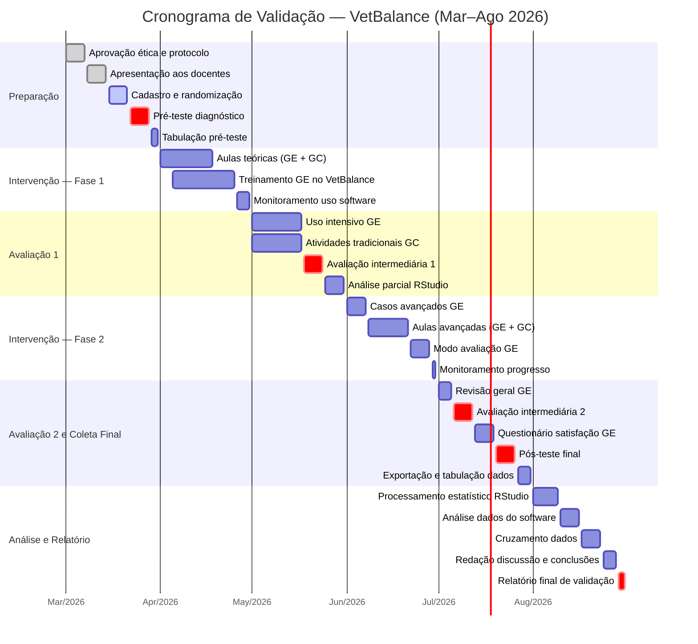

# CRONOGRAMA DE VALIDAÇÃO – VETBALANCE

## Aplicação do Software em Disciplinas de Medicina Veterinária

**Disciplinas:** Fisiologia Animal e Farmacologia (módulo: Equilíbrio Ácido-Base)  
**Período:** Março/2026 – Agosto/2026 (6 meses)  
**Metodologia:** Estudo comparativo randomizado — metade da turma utiliza o VetBalance (Grupo Experimental) e metade não utiliza (Grupo Controle)  
**URL do Software:** https://vetbalance.app.br

---

## DESENHO EXPERIMENTAL

| Item | Descrição |
|------|-----------|
| **Tipo de estudo** | Quase-experimental, controlado, com pré e pós-teste |
| **Disciplina 1** | Fisiologia Animal — equilíbrio ácido-base |
| **Disciplina 2** | Farmacologia — farmacoterapia dos distúrbios ácido-base |
| **Divisão dos grupos** | Randomização por sorteio simples em cada disciplina |
| **Grupo Experimental (GE)** | 50% da turma — acesso ao VetBalance durante todo o período |
| **Grupo Controle (GC)** | 50% da turma — metodologia tradicional (sem acesso ao software) |
| **Análise estatística** | Teste t de Student (α=0,05) — processamento no RStudio |

---

## CRONOGRAMA DETALHADO

### 📅 MÊS 1 — MARÇO/2026: Preparação e Linha de Base

| Semana | Atividade | Responsável |
|--------|-----------|-------------|
| 01–07/03 | Submissão e aprovação do protocolo no Comitê de Ética (se aplicável) | Pesquisador |
| 08–14/03 | Apresentação do projeto aos docentes das disciplinas | Pesquisador |
| 15–21/03 | Cadastro dos alunos no sistema e randomização dos grupos (GE e GC) | Pesquisador + Docentes |
| 22–28/03 | **Pré-teste diagnóstico** — avaliação de conhecimentos prévios sobre equilíbrio ácido-base (ambos os grupos, ambas as disciplinas) | Docentes |
| 29–31/03 | Tabulação dos resultados do pré-teste no RStudio | Pesquisador |

**Entregas do mês:**
- ✅ Grupos randomizados e cadastrados
- ✅ Pré-teste aplicado e tabulado
- ✅ Linha de base estabelecida

---

### 📅 MÊS 2 — ABRIL/2026: Início da Intervenção

| Semana | Atividade | Responsável |
|--------|-----------|-------------|
| 01–04/04 | **Fisiologia Animal:** Aulas teóricas sobre equilíbrio ácido-base (GE + GC) | Docente Fisiologia |
| 05–11/04 | **GE Fisiologia:** Treinamento no VetBalance — tutorial guiado + primeiros casos | Pesquisador |
| 12–18/04 | **Farmacologia:** Aulas teóricas sobre farmacoterapia ácido-base (GE + GC) | Docente Farmacologia |
| 19–25/04 | **GE Farmacologia:** Treinamento no VetBalance — tutorial guiado + primeiros casos | Pesquisador |
| 26–30/04 | Monitoramento do uso do software (logs, sessões, badges) | Pesquisador |

**Entregas do mês:**
- ✅ Aulas teóricas ministradas em ambas as disciplinas
- ✅ GE treinado e utilizando o software
- ✅ Primeiro ciclo de monitoramento

---

### 📅 MÊS 3 — MAIO/2026: Uso Intensivo e Primeira Avaliação

| Semana | Atividade | Responsável |
|--------|-----------|-------------|
| 01–10/05 | **GE:** Uso contínuo do VetBalance — casos de acidose e alcalose metabólica | Alunos GE |
| 11–17/05 | **GC:** Atividades complementares tradicionais (estudos de caso em papel, discussões) | Docentes |
| 18–24/05 | **Avaliação intermediária 1** — prova teórico-prática sobre distúrbios metabólicos (GE + GC, ambas disciplinas) | Docentes |
| 25–31/05 | Tabulação e análise parcial dos resultados no RStudio | Pesquisador |

**Entregas do mês:**
- ✅ Avaliação intermediária 1 aplicada
- ✅ Dados parciais analisados
- ✅ Relatório de uso do software (sessões, win rate, badges conquistados)

---

### 📅 MÊS 4 — JUNHO/2026: Aprofundamento e Casos Complexos

| Semana | Atividade | Responsável |
|--------|-----------|-------------|
| 01–07/06 | **GE:** Casos avançados no VetBalance — cetoacidose diabética, hipercapnia, distúrbios mistos | Alunos GE |
| 08–14/06 | **Fisiologia:** Aulas sobre compensação respiratória e renal (GE + GC) | Docente Fisiologia |
| 15–21/06 | **Farmacologia:** Aulas sobre protocolos terapêuticos avançados (GE + GC) | Docente Farmacologia |
| 22–28/06 | **GE:** Modo avaliação do VetBalance (sem dicas de IA) — simulação de cenário real | Alunos GE |
| 29–30/06 | Monitoramento do progresso e ranking semanal | Pesquisador |

**Entregas do mês:**
- ✅ Casos complexos completados pelo GE
- ✅ Conteúdo avançado ministrado em ambas as disciplinas
- ✅ Segundo ciclo de monitoramento

---

### 📅 MÊS 5 — JULHO/2026: Segunda Avaliação e Coleta Final

| Semana | Atividade | Responsável |
|--------|-----------|-------------|
| 01–05/07 | **GE:** Últimas sessões no VetBalance — revisão geral de todos os casos | Alunos GE |
| 06–12/07 | **Avaliação intermediária 2** — prova teórico-prática sobre distúrbios respiratórios e mistos (GE + GC) | Docentes |
| 13–19/07 | Aplicação de **questionário de satisfação** ao GE (usabilidade, engajamento, percepção de aprendizagem) | Pesquisador |
| 20–26/07 | **Pós-teste final** — avaliação abrangente de equilíbrio ácido-base (GE + GC, ambas disciplinas) | Docentes |
| 27–31/07 | Exportação completa dos dados do VetBalance (CSV/TXT) e tabulação do pós-teste | Pesquisador |

**Entregas do mês:**
- ✅ Avaliação intermediária 2 aplicada
- ✅ Pós-teste final aplicado
- ✅ Questionário de satisfação coletado
- ✅ Todos os dados exportados

---

### 📅 MÊS 6 — AGOSTO/2026: Análise Estatística e Relatório Final

| Semana | Atividade | Responsável |
|--------|-----------|-------------|
| 01–09/08 | Processamento estatístico no RStudio: teste t de Student (pré vs pós, GE vs GC) | Pesquisador |
| 10–16/08 | Análise dos dados do software: sessões, win rate, tempo médio, badges, ranking | Pesquisador |
| 17–23/08 | Cruzamento de dados: desempenho no software × notas nas avaliações | Pesquisador |
| 24–28/08 | Redação da discussão dos resultados e conclusões | Pesquisador |
| 29–31/08 | **Relatório final de validação** — compilação de todos os dados e análises | Pesquisador |

**Entregas do mês:**
- ✅ Análise estatística concluída
- ✅ Relatório final de validação redigido
- ✅ Dados prontos para inclusão na dissertação

---

## INSTRUMENTOS DE COLETA DE DADOS

| Instrumento | Momento | Aplicação |
|-------------|---------|-----------|
| **Pré-teste diagnóstico** | Março/2026 | GE + GC — conhecimentos prévios |
| **Avaliação intermediária 1** | Maio/2026 | GE + GC — distúrbios metabólicos |
| **Avaliação intermediária 2** | Julho/2026 | GE + GC — distúrbios respiratórios e mistos |
| **Pós-teste final** | Julho/2026 | GE + GC — avaliação abrangente |
| **Questionário de satisfação** | Julho/2026 | Apenas GE — percepção de usabilidade |
| **Dados do VetBalance** | Contínuo | Apenas GE — logs automáticos do sistema |

---

## DADOS COLETADOS AUTOMATICAMENTE PELO VETBALANCE (Grupo Experimental)

| Dado | Tabela no Banco | Descrição |
|------|-----------------|-----------|
| Sessões de simulação | `simulation_sessions` | Data, duração, caso, resultado (vitória/derrota) |
| Histórico de parâmetros | `session_history` | Snapshots dos parâmetros fisiológicos por segundo |
| Decisões clínicas | `session_decisions` | Tratamentos aplicados, HP antes/depois |
| Tratamentos aplicados | `session_treatments` | Tratamento, timestamp, sessão |
| Badges conquistados | `user_badges` | Conquistas gamificadas e data |
| Ranking semanal | `weekly_ranking_history` | Posição, pontos, win rate por semana |
| Notas de simulação | `simulation_notes` | Anotações clínicas do aluno |

---

## ANÁLISE ESTATÍSTICA PLANEJADA

| Análise | Ferramenta | Variáveis |
|---------|------------|-----------|
| Comparação GE vs GC (pré-teste) | Teste t de Student | Nota pré-teste |
| Comparação GE vs GC (pós-teste) | Teste t de Student | Nota pós-teste |
| Evolução intra-grupo | Teste t pareado | Pré vs pós (dentro de cada grupo) |
| Tamanho do efeito | d de Cohen | Magnitude da diferença |
| Correlação software × notas | Correlação de Pearson | Win rate × nota pós-teste |
| Nível de significância | α = 0,05 | — |
| Software estatístico | **RStudio** | — |

---

## DIAGRAMA VISUAL DO CRONOGRAMA

---

## CONSIDERAÇÕES ÉTICAS

- O estudo será submetido ao Comitê de Ética em Pesquisa (CEP) da instituição, se exigido
- Todos os participantes assinarão Termo de Consentimento Livre e Esclarecido (TCLE)
- Após o término da coleta, o Grupo Controle terá acesso ao VetBalance para garantir equidade
- Nenhum dado pessoal será exposto — o sistema utiliza RLS (Row Level Security) em todas as tabelas
- Os dados serão anonimizados na apresentação dos resultados

---

**Documento vinculado ao projeto:** [VetBalance](https://vetbalance.app.br)  
**Repositório:** [GitHub](https://github.com/KyoFaBraL/vet-sim-buddy)
