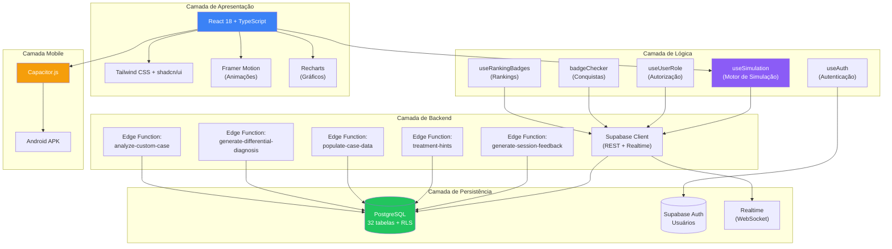
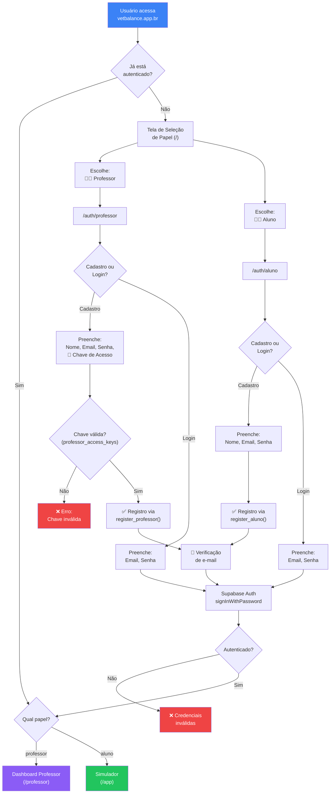
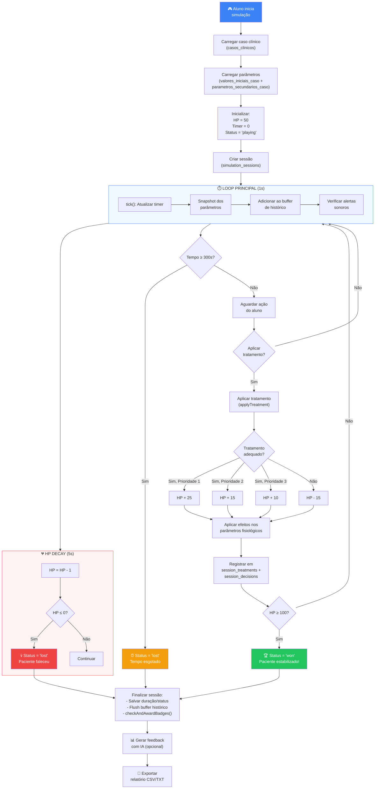
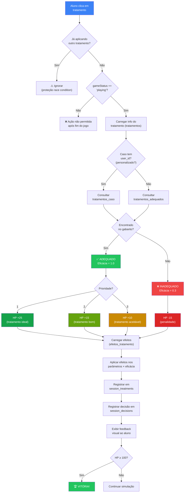
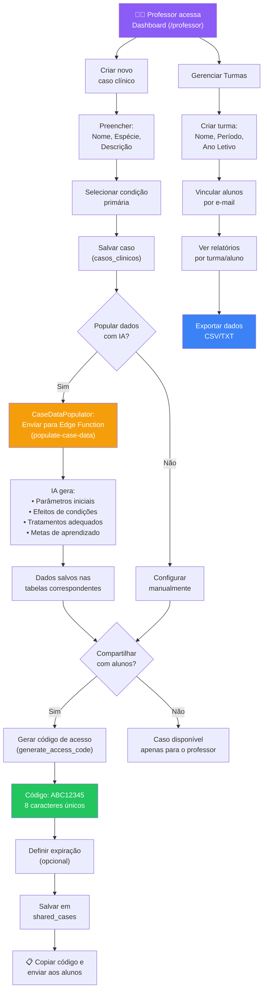
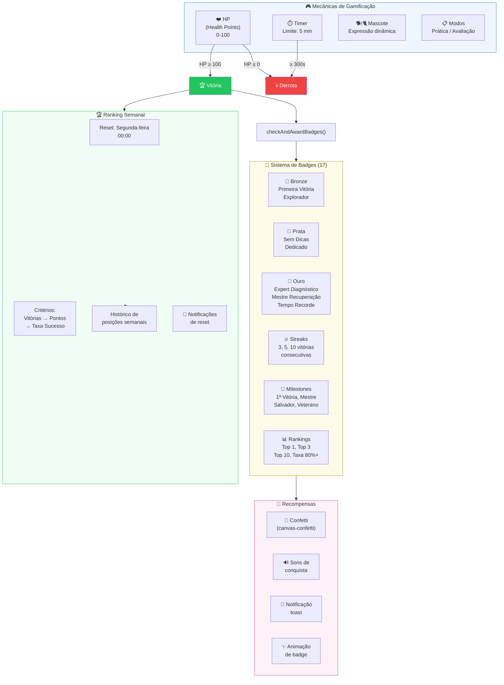
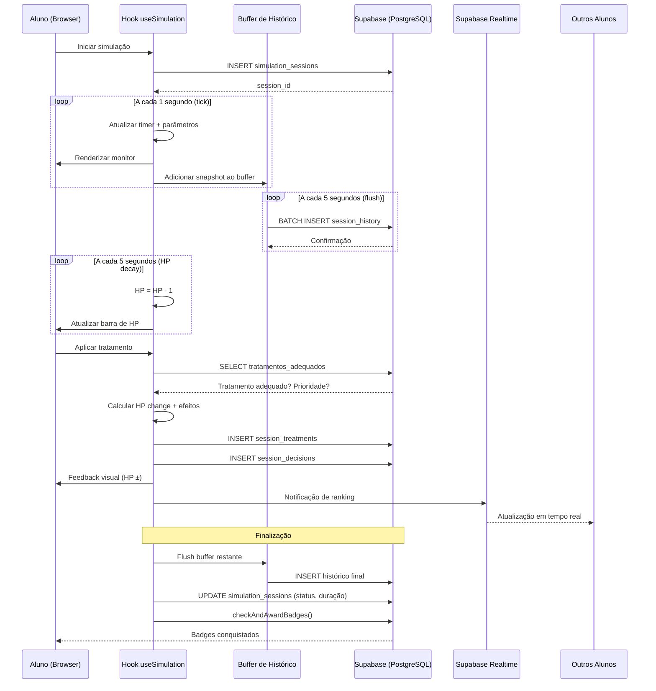
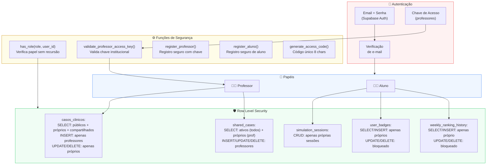
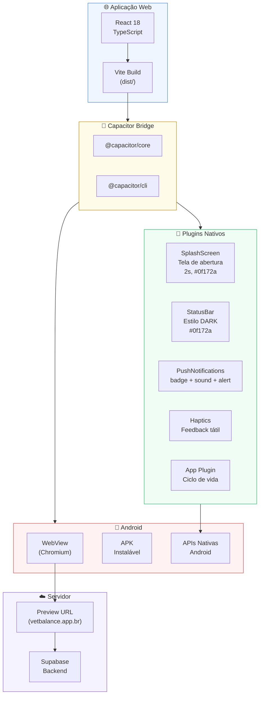

# DIAGRAMAS VISUAIS – VETBALANCE

## Diagramas de Fluxo e Arquitetura

---

## Diagrama 1 – Arquitetura Geral do Sistema

---

## Diagrama 2 – Fluxo de Autenticação e Autorização

---

## Diagrama 3 – Ciclo de Vida da Simulação

---

## Diagrama 4 – Sistema de Tratamentos e Validação

---

## Diagrama 5 – Modelo Entidade-Relacionamento

```mermaid
erDiagram
    profiles {
        uuid id PK
        string nome_completo
        string email
        timestamp created_at
    }

    user_roles {
        uuid id PK
        uuid user_id FK
        enum role "professor | aluno"
        timestamp criado_em
    }

    casos_clinicos {
        int id PK
        string nome
        string especie
        string descricao
        int id_condicao_primaria FK
        uuid user_id FK
    }

    condicoes {
        int id PK
        string nome
        string descricao
    }

    parametros {
        int id PK
        string nome
        string unidade
        float valor_minimo
        float valor_maximo
    }

    valores_iniciais_caso {
        int id PK
        int id_caso FK
        int id_parametro FK
        float valor
    }

    tratamentos {
        int id PK
        string nome
        string tipo
        string descricao
    }

    efeitos_tratamento {
        int id PK
        int id_tratamento FK
        int id_parametro FK
        float magnitude
    }

    efeitos_condicao {
        int id PK
        int id_condicao FK
        int id_parametro FK
        float magnitude
    }

    simulation_sessions {
        uuid id PK
        uuid user_id FK
        int case_id FK
        string nome
        string status
        int duracao_segundos
    }

    session_history {
        uuid id PK
        uuid session_id FK
        int parametro_id FK
        int timestamp
        float valor
    }

    session_treatments {
        uuid id PK
        uuid session_id FK
        int tratamento_id FK
        int timestamp_simulacao
    }

    session_decisions {
        uuid id PK
        uuid session_id FK
        string tipo
        json dados
        int hp_antes
        int hp_depois
    }

    badges {
        uuid id PK
        string nome
        string tipo
        string icone
        json criterio
    }

    user_badges {
        uuid id PK
        uuid user_id FK
        uuid badge_id FK
        uuid session_id FK
        timestamp conquistado_em
    }

    shared_cases {
        uuid id PK
        uuid shared_by FK
        int case_id FK
        string access_code
        string titulo
        boolean ativo
    }

    weekly_ranking_history {
        uuid id PK
        uuid user_id FK
        date week_start
        date week_end
        int position
        int wins
        float win_rate
    }

    turmas {
        uuid id PK
        uuid professor_id FK
        string nome
        string periodo
        boolean ativo
    }

    professor_students {
        uuid id PK
        uuid professor_id FK
        uuid student_id FK
        uuid turma_id FK
    }

    profiles ||--o{ user_roles : "tem"
    profiles ||--o{ simulation_sessions : "realiza"
    profiles ||--o{ user_badges : "conquista"
    profiles ||--o{ weekly_ranking_history : "registra"
    profiles ||--o{ casos_clinicos : "cria"
    profiles ||--o{ turmas : "gerencia"
    profiles ||--o{ professor_students : "vincula"

    casos_clinicos ||--o| condicoes : "possui"
    casos_clinicos ||--o{ valores_iniciais_caso : "define"
    casos_clinicos ||--o{ simulation_sessions : "simula"
    casos_clinicos ||--o{ shared_cases : "compartilha"

    condicoes ||--o{ efeitos_condicao : "causa"

    parametros ||--o{ valores_iniciais_caso : "parametriza"
    parametros ||--o{ efeitos_tratamento : "afetado por"
    parametros ||--o{ efeitos_condicao : "afetado por"
    parametros ||--o{ session_history : "registrado em"

    tratamentos ||--o{ efeitos_tratamento : "produz"
    tratamentos ||--o{ session_treatments : "aplicado em"

    simulation_sessions ||--o{ session_history : "registra"
    simulation_sessions ||--o{ session_treatments : "contém"
    simulation_sessions ||--o{ session_decisions : "documenta"
    simulation_sessions ||--o{ user_badges : "concede"

    badges ||--o{ user_badges : "instanciado em"

    turmas ||--o{ professor_students : "agrupa"
```

---

## Diagrama 6 – Fluxo do Professor (Criação e Compartilhamento)

---

## Diagrama 7 – Sistema de Gamificação

---

## Diagrama 8 – Fluxo de Dados em Tempo Real

---

## Diagrama 9 – Segurança e Controle de Acesso (RLS)

---

## Diagrama 10 – Arquitetura Mobile (Capacitor)

---

## Como Renderizar os Diagramas

- **GitHub:** Visualize este arquivo diretamente no GitHub — os diagramas Mermaid são renderizados automaticamente.
- **Mermaid Live Editor:** Acesse [mermaid.live](https://mermaid.live), cole o código do diagrama e exporte como PNG/SVG.
- **VS Code:** Instale a extensão "Markdown Preview Mermaid Support" e abra o preview do arquivo.
