# DOCUMENTAÇÃO TÉCNICA COMPLETA DO SOFTWARE

## VETBALANCE – Simulador Veterinário Gamificado para Ensino de Equilíbrio Ácido-Base em Pequenos Animais

**Versão:** 1.0  
**Data:** Fevereiro de 2026  
**Formato:** Progressive Web App (PWA)  
**URL de Produção:** https://vetbalance.app.br

---

## SUMÁRIO

1. [Visão Geral do Sistema](#1-visão-geral-do-sistema)
2. [Arquitetura Técnica](#2-arquitetura-técnica)
3. [Stack Tecnológica](#3-stack-tecnológica)
4. [Estrutura do Banco de Dados](#4-estrutura-do-banco-de-dados)
5. [Módulos e Funcionalidades](#5-módulos-e-funcionalidades)
6. [Algoritmo de Simulação](#6-algoritmo-de-simulação)
7. [Sistema de Gamificação](#7-sistema-de-gamificação)
8. [Segurança e Controle de Acesso](#8-segurança-e-controle-de-acesso)
9. [Integração com Inteligência Artificial](#9-integração-com-inteligência-artificial)
10. [Casos Clínicos Cadastrados](#10-casos-clínicos-cadastrados)
11. [Parâmetros Fisiológicos Monitorados](#11-parâmetros-fisiológicos-monitorados)
12. [Tratamentos Disponíveis](#12-tratamentos-disponíveis)
13. [Sistema de Badges e Conquistas](#13-sistema-de-badges-e-conquistas)
14. [Ranking e Competição](#14-ranking-e-competição)
15. [Relatórios e Exportação de Dados](#15-relatórios-e-exportação-de-dados)
16. [Compatibilidade Mobile](#16-compatibilidade-mobile)
17. [Fluxos de Uso Detalhados](#17-fluxos-de-uso-detalhados)
18. [Diagramas Visuais de Fluxo](#18-diagramas-visuais-de-fluxo)
19. [Evidências Visuais – Capturas de Tela](#19-evidências-visuais--capturas-de-tela)
20. [Requisitos de Sistema](#20-requisitos-de-sistema)
21. [Glossário Técnico](#21-glossário-técnico)
22. [Cronograma de Validação](#22-cronograma-de-validação)

---

## 1. VISÃO GERAL DO SISTEMA

O **VetBalance** é um software educacional gamificado desenvolvido como ferramenta de m-learning para navegadores web. O sistema simula cenários clínicos veterinários focados em distúrbios do equilíbrio ácido-base em pequenos animais (cães e gatos), permitindo que estudantes e profissionais pratiquem a identificação e o tratamento dessas condições em ambiente seguro e controlado.

### 1.1 Objetivos do Software

- Simular em tempo real a evolução de parâmetros fisiológicos de pacientes veterinários críticos
- Permitir a prática de tomada de decisão clínica sem risco a pacientes reais
- Gamificar o processo de aprendizagem com HP, badges, rankings e feedback imediato
- Fornecer ferramentas para professores criarem e compartilharem casos clínicos personalizados
- Registrar e analisar o desempenho dos estudantes ao longo do tempo
- Disponibilizar relatórios exportáveis para análise acadêmica

### 1.2 Público-Alvo

| Perfil | Descrição |
|--------|-----------|
| **Estudantes de Medicina Veterinária** | Utilizam o simulador para praticar e aprender |
| **Professores/Docentes** | Criam casos, gerenciam turmas e analisam desempenho |
| **Profissionais recém-formados** | Aprimoram competências em equilíbrio ácido-base |

---

## 2. ARQUITETURA TÉCNICA

### 2.1 Diagrama de Arquitetura

```
┌─────────────────────────────────────────────────────────────┐
│                    CAMADA DE APRESENTAÇÃO                    │
│  ┌──────────┐  ┌──────────────┐  ┌────────────────────┐    │
│  │ React 18 │  │ Tailwind CSS │  │ Framer Motion      │    │
│  │ TypeScript│  │ shadcn/ui    │  │ Recharts           │    │
│  └──────────┘  └──────────────┘  └────────────────────┘    │
├─────────────────────────────────────────────────────────────┤
│                    CAMADA DE LÓGICA                          │
│  ┌──────────────────┐  ┌─────────────────────────────┐     │
│  │ Hooks Customizados│  │ Motor de Simulação          │     │
│  │ useSimulation     │  │ (tick, HP decay, treatments) │     │
│  │ useAuth           │  │                             │     │
│  │ useUserRole       │  │                             │     │
│  └──────────────────┘  └─────────────────────────────┘     │
├─────────────────────────────────────────────────────────────┤
│                    CAMADA DE DADOS                           │
│  ┌────────────────────┐  ┌──────────────────────────┐      │
│  │ Supabase Client    │  │ Edge Functions (Deno)     │      │
│  │ (REST + Realtime)  │  │ - IA (Gemini/GPT)        │      │
│  └────────────────────┘  │ - Feedback de sessão     │      │
│                          │ - Dicas de tratamento    │      │
│                          └──────────────────────────┘      │
├─────────────────────────────────────────────────────────────┤
│                    CAMADA DE PERSISTÊNCIA                    │
│  ┌──────────────────────────────────────────────────┐      │
│  │ PostgreSQL (Supabase)                             │      │
│  │ 32 tabelas + RLS (Row Level Security)             │      │
│  │ Autenticação integrada                            │      │
│  └──────────────────────────────────────────────────┘      │
├─────────────────────────────────────────────────────────────┤
└─────────────────────────────────────────────────────────────┘
```

### 2.2 Padrão Arquitetural

O sistema adota o padrão **Component-Based Architecture** com separação clara de responsabilidades:

- **Componentes de UI** (`src/components/`): Renderização visual e interação do usuário
- **Hooks customizados** (`src/hooks/`): Lógica de estado e efeitos colaterais
- **Utilitários** (`src/utils/`): Funções auxiliares puras
- **Constantes** (`src/constants/`): Dados estáticos e descrições de parâmetros
- **Páginas** (`src/pages/`): Composição de componentes por rota
- **Edge Functions** (`supabase/functions/`): Lógica de backend e IA

---

## 3. STACK TECNOLÓGICA

### 3.1 Frontend

| Tecnologia | Versão | Finalidade |
|-----------|--------|-----------|
| **React** | 18.3.1 | Biblioteca de interface de usuário |
| **TypeScript** | — | Tipagem estática e segurança de código |
| **Vite** | — | Build tool e servidor de desenvolvimento |
| **Tailwind CSS** | — | Framework de estilização utilitária |
| **shadcn/ui** | — | Componentes acessíveis (Radix UI) |
| **Framer Motion** | 12.23+ | Animações e transições |
| **Recharts** | 2.15+ | Gráficos e visualizações de dados |
| **React Router DOM** | 6.30+ | Roteamento SPA |
| **TanStack React Query** | 5.83+ | Gerenciamento de estado assíncrono |
| **React Hook Form** | 7.61+ | Gerenciamento de formulários |
| **Zod** | 3.25+ | Validação de schemas |
| **canvas-confetti** | 1.9+ | Animações de conquistas |
| **date-fns** | 3.6+ | Manipulação de datas |
| **Lucide React** | 0.462+ | Ícones SVG |

### 3.2 Backend

| Tecnologia | Finalidade |
|-----------|-----------|
| **Supabase (PostgreSQL)** | Banco de dados relacional |
| **Supabase Auth** | Autenticação e autorização |
| **Supabase Realtime** | Atualizações em tempo real |
| **Edge Functions (Deno)** | Lógica de servidor serverless |
| **Row Level Security (RLS)** | Segurança em nível de linha |


---

## 4. ESTRUTURA DO BANCO DE DADOS

O sistema utiliza **32 tabelas** no esquema público do PostgreSQL, organizadas nas seguintes categorias:

### 4.1 Tabelas Principais

#### Casos Clínicos e Simulação

| Tabela | Descrição | Registros |
|--------|-----------|-----------|
| `casos_clinicos` | Casos clínicos cadastrados | 8 |
| `condicoes` | Condições/patologias clínicas | 9 |
| `parametros` | Parâmetros fisiológicos monitoráveis | 10 |
| `valores_iniciais_caso` | Valores iniciais dos parâmetros por caso | — |
| `parametros_secundarios_caso` | Parâmetros secundários por caso | — |
| `efeitos_condicao` | Efeitos das condições sobre parâmetros | — |
| `tratamentos` | Tratamentos disponíveis | 8 |
| `efeitos_tratamento` | Efeitos dos tratamentos sobre parâmetros | — |
| `tratamentos_adequados` | Gabarito de tratamentos por condição | — |
| `tratamentos_caso` | Tratamentos personalizados por caso | — |

#### Sessões e Histórico

| Tabela | Descrição |
|--------|-----------|
| `simulation_sessions` | Registro de cada sessão de simulação |
| `session_history` | Histórico dos parâmetros a cada tick |
| `session_decisions` | Decisões tomadas pelo aluno durante a sessão |
| `session_treatments` | Tratamentos aplicados durante a sessão |
| `simulation_notes` | Anotações do aluno durante a simulação |

#### Usuários e Permissões

| Tabela | Descrição |
|--------|-----------|
| `profiles` | Perfis de usuários (nome, email) |
| `user_roles` | Papéis dos usuários (professor/aluno) |
| `professor_students` | Vínculo professor-aluno |
| `professor_access_keys` | Chaves de acesso para registro de professores |
| `professor_private_notes` | Notas privadas do professor sobre alunos |
| `turmas` | Turmas/classes criadas por professores |
| `email_lookup_attempts` | Log de buscas por e-mail |

#### Gamificação

| Tabela | Descrição |
|--------|-----------|
| `badges` | Definição dos badges disponíveis | 
| `user_badges` | Badges conquistados por usuários |
| `metas_aprendizado` | Metas de aprendizado por caso |
| `metas_alcancadas` | Registro de metas alcançadas |
| `weekly_ranking_history` | Histórico semanal de posições no ranking |

#### Compartilhamento e Tutorial

| Tabela | Descrição |
|--------|-----------|
| `shared_cases` | Casos compartilhados com códigos de acesso |
| `shared_case_access` | Log de acessos a casos compartilhados |
| `tutorial_steps` | Passos do tutorial guiado |
| `user_tutorial_progress` | Progresso do tutorial por usuário |

### 4.2 Diagrama Entidade-Relacionamento (Simplificado)

```
┌──────────────┐     ┌───────────────────┐     ┌──────────────┐
│   profiles   │────▶│ simulation_sessions│────▶│session_history│
│  (usuários)  │     │   (sessões)       │     │  (snapshots) │
└──────┬───────┘     └────────┬──────────┘     └──────────────┘
       │                      │
       │              ┌───────┴────────┐
       │              │                │
       │     ┌────────▼──────┐  ┌──────▼──────────┐
       │     │session_decisions│  │session_treatments│
       │     └───────────────┘  └─────────────────┘
       │
┌──────▼───────┐     ┌───────────────┐     ┌──────────────┐
│  user_roles  │     │ casos_clinicos│────▶│  condicoes   │
│(professor/   │     │   (casos)     │     │ (patologias) │
│  aluno)      │     └───────┬───────┘     └──────┬───────┘
└──────────────┘             │                    │
                     ┌───────▼───────┐    ┌───────▼──────────┐
                     │valores_iniciais│    │efeitos_condicao  │
                     │    _caso      │    │  (magnitude)     │
                     └───────────────┘    └──────────────────┘
                                                  │
                     ┌──────────────┐     ┌───────▼──────────┐
                     │  tratamentos │────▶│efeitos_tratamento│
                     │  (terapias)  │     │  (magnitude)     │
                     └──────────────┘     └──────────────────┘
```

---

## 5. MÓDULOS E FUNCIONALIDADES

### 5.1 Módulo de Autenticação

| Componente | Arquivo | Funcionalidade |
|-----------|---------|----------------|
| Seleção de Papel | `RoleSelection.tsx` | Tela inicial: escolha entre Professor e Aluno |
| Login Professor | `AuthProfessor.tsx` | Cadastro/login com chave de acesso institucional |
| Login Aluno | `AuthAluno.tsx` | Cadastro/login simplificado para estudantes |
| Reset de Senha | `ResetPassword.tsx` | Recuperação de senha por e-mail |
| Hook de Auth | `useAuth.ts` | Gerenciamento do estado de autenticação |
| Hook de Role | `useUserRole.ts` | Verificação do papel do usuário |

**Fluxo de autenticação:**
1. Usuário acessa a aplicação → Tela de seleção de papel
2. Escolhe "Professor" ou "Aluno" → Redirecionado ao formulário correspondente
3. Realiza cadastro (com validação de e-mail) ou login
4. Sistema verifica papel na tabela `user_roles`
5. Redireciona para dashboard correspondente (`/professor` ou `/app`)

### 5.2 Módulo de Simulação (Aluno)

| Componente | Funcionalidade |
|-----------|----------------|
| `SimulationWorkspace` | Workspace principal da simulação |
| `PatientMonitor` | Monitor de sinais vitais em tempo real |
| `MonitorDisplay` | Display visual dos parâmetros |
| `SimulationControls` | Controles: Iniciar/Pausar/Resetar |
| `HPDisplay` | Barra de HP do paciente virtual |
| `ParameterChart` | Gráficos de evolução dos parâmetros |
| `TreatmentPanel` | Painel de seleção e aplicação de tratamentos |
| `TreatmentFeedback` | Feedback visual sobre tratamentos aplicados |
| `TreatmentHints` | Dicas contextualizadas via IA |
| `DiagnosticChallenge` | Desafio de diagnóstico diferencial |
| `SimulationNotes` | Anotações durante a simulação |
| `SoundAlerts` / `SoundAlertsExtended` | Alertas sonoros para parâmetros críticos |
| `CaseInfo` | Informações detalhadas do caso clínico |
| `SimulationModeSelector` | Seleção: modo Prática vs. Avaliação |

### 5.3 Módulo do Professor

| Componente | Funcionalidade |
|-----------|----------------|
| `ProfessorDashboard` | Painel principal do professor |
| `CaseManager` | Criação e edição de casos clínicos |
| `CaseDataPopulator` | Geração automática de dados via IA |
| `CaseShareManager` | Compartilhamento via códigos de acesso |
| `CaseLibrary` | Biblioteca de todos os casos |
| `ClassManager` | Gerenciamento de turmas |
| `StudentManagement` | Vínculo e gestão de alunos |
| `StudentReports` | Relatórios de desempenho dos alunos |
| `StudentRanking` | Ranking de alunos por desempenho |
| `ProfessorAccessKeys` | Geração de chaves de acesso |
| `UserManagement` | Gerenciamento de usuários |
| `AdvancedReports` | Relatórios avançados com gráficos |

### 5.4 Módulo de Gamificação

| Componente | Funcionalidade |
|-----------|----------------|
| `BadgeSystem` | Sistema completo de badges |
| `WeeklyLeaderboard` | Ranking semanal com reset automático |
| `WeeklyRankingHistory` | Histórico de evolução no ranking |
| `WinLossStats` | Estatísticas de vitórias/derrotas |
| `PerformanceStatistics` | Estatísticas detalhadas de desempenho |
| `RankingNotifications` | Notificações de mudança de posição |
| `LearningGoals` | Metas de aprendizado por caso |

### 5.5 Módulo de Relatórios

| Componente | Funcionalidade |
|-----------|----------------|
| `ReportPanel` | Exportação CSV e TXT |
| `SessionHistory` | Histórico de sessões anteriores |
| `SessionComparison` | Comparação entre sessões |
| `SessionFeedbackReport` | Relatório de feedback gerado por IA |
| `SessionReplay` | Replay visual de sessões passadas |
| `SimulationComparison` | Comparação de desempenho entre simulações |
| `PerformanceStats` | Dashboard de estatísticas |

---

## 6. ALGORITMO DE SIMULAÇÃO

### 6.1 Ciclo Principal (Hook `useSimulation`)

O motor de simulação é implementado no hook `useSimulation.ts` (808 linhas) e gerencia todo o ciclo de vida de uma sessão:

```
INICIALIZAÇÃO
    ↓
Carregar caso clínico (casos_clinicos)
    ↓
Carregar parâmetros (parametros)
    ↓
Carregar valores iniciais (valores_iniciais_caso + parametros_secundarios_caso)
    ↓
Definir HP = 50, Status = 'playing'
    ↓
LOOP DE SIMULAÇÃO (a cada 1 segundo)
    ├── Salvar estado anterior (previousState)
    ├── Incrementar tempo decorrido
    ├── Registrar snapshot dos parâmetros no histórico
    ├── Enviar dados para buffer de persistência
    ├── Verificar alertas sonoros
    └── Atualizar interface
    ↓
HP DECAY (a cada 5 segundos)
    ├── HP = HP - 1
    ├── Atualizar HP mínimo da sessão
    ├── Se HP ≤ 0 → Status = 'lost' (paciente faleceu)
    └── Registrar decisão no banco
    ↓
VERIFICAÇÃO DE TEMPO LIMITE
    └── Se tempo ≥ 300s (5 min) → Status = 'lost' (tempo esgotado)
    ↓
APLICAÇÃO DE TRATAMENTO (ação do usuário)
    ├── Validar estado do jogo (deve ser 'playing')
    ├── Prevenir clicks duplicados (race condition protection)
    ├── Verificar se tratamento é adequado (gabarito)
    │   ├── Caso personalizado → consultar tratamentos_caso
    │   └── Caso pré-definido → consultar tratamentos_adequados
    ├── Calcular variação de HP:
    │   ├── Prioridade 1: +25 HP
    │   ├── Prioridade 2: +15 HP
    │   ├── Prioridade 3: +10 HP
    │   └── Inadequado: -15 HP
    ├── Aplicar efeitos nos parâmetros (efeitos_tratamento × eficácia)
    ├── Registrar tratamento (session_treatments)
    ├── Registrar decisão (session_decisions)
    └── Se HP ≥ 100 → Status = 'won' (paciente estabilizado)
    ↓
FINALIZAÇÃO
    ├── Salvar duração e status na sessão
    ├── Flush do buffer de histórico
    └── Verificar e conceder badges (checkAndAwardBadges)
```

### 6.2 Sistema de HP (Health Points)

| Parâmetro | Valor |
|-----------|-------|
| HP Inicial | 50 |
| HP para Vitória | ≥ 100 |
| HP para Derrota | ≤ 0 |
| Decremento por tempo | -1 HP a cada 5 segundos |
| Tratamento adequado (prioridade 1) | +25 HP |
| Tratamento adequado (prioridade 2) | +15 HP |
| Tratamento adequado (prioridade 3) | +10 HP |
| Tratamento inadequado | -15 HP |

### 6.3 Persistência de Dados

O sistema utiliza **batch insert** otimizado:
- Buffer acumula snapshots de parâmetros
- Flush automático a cada 5 segundos
- Flush forçado ao finalizar sessão
- Retry com backoff exponencial para operações críticas (3 tentativas)

---

## 7. SISTEMA DE GAMIFICAÇÃO

### 7.1 Mecânicas de Jogo

| Mecânica | Descrição |
|----------|-----------|
| **HP (Pontos de Vida)** | Simula saúde do paciente, decai com o tempo |
| **Feedback Imediato** | Tratamentos corretos/incorretos com indicação visual |
| **Badges/Conquistas** | 17 badges em 5 categorias |
| **Ranking Semanal** | Leaderboard com reset automático (segunda-feira) |
| **Histórico de Evolução** | Gráfico de posição no ranking ao longo das semanas |
| **Modos de Jogo** | Prática (com dicas) e Avaliação (sem dicas) |
| **Desafio Diagnóstico** | Quiz de diagnóstico diferencial com IA |
| **Metas de Aprendizado** | Objetivos específicos por caso |
| **Animações de Conquista** | Confetti e efeitos visuais com canvas-confetti |
| **Mascotes** | Gato e cachorro com expressões baseadas no HP |

### 7.2 Mascotes do Paciente

O sistema inclui mascotes animados que refletem o estado do paciente:

| Estado HP | Expressão | Arquivo (Cão) | Arquivo (Gato) |
|----------|-----------|---------------|----------------|
| HP > 80 | Feliz | `dog-happy.png` | `cat-happy.png` |
| HP 40-80 | Normal | `dog-normal.png` | `cat-normal.png` |
| HP 20-40 | Triste | `dog-sad.png` | `cat-sad.png` |
| HP ≤ 0 | Falecido | `dog-rip.png` | `cat-rip.png` |
| Vitória | Comemorando | `dog-victory.png` | `cat-victory.png` |

---

## 8. SEGURANÇA E CONTROLE DE ACESSO

### 8.1 Autenticação

- **Método:** E-mail + senha via Supabase Auth
- **Verificação:** Confirmação de e-mail obrigatória
- **Recuperação:** Reset de senha via link por e-mail
- **Professores:** Necessitam chave de acesso institucional válida
- **Sessões:** Gerenciadas automaticamente pelo Supabase Auth

### 8.2 Autorização (Dois Papéis)

| Papel | Enum | Permissões |
|-------|------|-----------|
| **Professor** | `professor` | Criar/editar/deletar casos, gerenciar turmas, ver relatórios de alunos, compartilhar casos, gerar chaves de acesso |
| **Aluno** | `aluno` | Executar simulações, aplicar tratamentos, ver próprio histórico, conquistar badges, acessar casos compartilhados |

### 8.3 Row Level Security (RLS)

Todas as tabelas possuem RLS habilitado. As principais políticas:

| Tabela | SELECT | INSERT | UPDATE | DELETE |
|--------|--------|--------|--------|--------|
| `user_roles` | Próprio | Próprio | ❌ | ❌ |
| `casos_clinicos` | Públicos + próprios + compartilhados | Professores | Próprios | Próprios |
| `simulation_sessions` | Próprias | Próprias | Próprias | Próprias |
| `user_badges` | Próprios | Próprios | ❌ | ❌ |
| `shared_cases` | Ativos + próprios (prof.) | Professores | Próprios | Próprios |
| `shared_case_access` | Próprios | Próprios | ❌ | ❌ |
| `weekly_ranking_history` | Próprio | Próprio | ❌ | ❌ |

### 8.4 Funções de Segurança

| Função | Finalidade |
|--------|-----------|
| `has_role(role, user_id)` | Verifica papel do usuário sem recursão RLS |
| `validate_professor_access_key(key)` | Valida chave de acesso para professores |
| `register_professor(...)` | Registro seguro de professor com chave |
| `register_aluno(...)` | Registro seguro de aluno |
| `generate_access_code()` | Gera código único de compartilhamento |
| `get_shared_case_by_code(code)` | Busca caso compartilhado por código |
| `get_student_id_by_email(email)` | Busca aluno por e-mail (para vínculo) |

---

## 9. INTEGRAÇÃO COM INTELIGÊNCIA ARTIFICIAL

O sistema integra modelos de IA via Edge Functions (Deno) para enriquecer a experiência educacional:

### 9.1 Edge Functions

| Função | Endpoint | Finalidade |
|--------|----------|-----------|
| `analyze-custom-case` | `/analyze-custom-case` | Análise automática de casos personalizados |
| `autofix-case` | `/autofix-case` | Correção automática de inconsistências em casos |
| `generate-differential-diagnosis` | `/generate-differential-diagnosis` | Geração de diagnósticos diferenciais |
| `generate-random-case` | `/generate-random-case` | Geração aleatória de casos clínicos |
| `generate-session-feedback` | `/generate-session-feedback` | Feedback personalizado pós-sessão |
| `populate-case-data` | `/populate-case-data` | Geração automática de parâmetros e tratamentos |
| `treatment-hints` | `/treatment-hints` | Dicas contextualizadas de tratamento |
| `update-case-data` | `/update-case-data` | Atualização de dados de casos existentes |
| `validate-case-acidbase` | `/validate-case-acidbase` | Validação de consistência ácido-base dos casos |

### 9.2 Modelos Utilizados

- **Google Gemini 2.5 Flash/Pro** – Para análise de casos e geração de conteúdo clínico
- **OpenAI GPT** – Para feedback de sessão e diagnóstico diferencial

### 9.3 Exemplos de Uso da IA

**Geração de Caso Clínico (CaseDataPopulator):**
- Professor descreve cenário clínico em texto livre
- IA analisa e gera: parâmetros iniciais, efeitos de condições, tratamentos adequados com prioridades, e metas de aprendizado

**Feedback de Sessão:**
- Após cada simulação, a IA analisa: tratamentos aplicados, evolução dos parâmetros, tempo de resposta, e HP final
- Gera relatório textual com pontos fortes, áreas de melhoria e recomendações

**Dicas de Tratamento:**
- Durante a simulação, o aluno pode solicitar dicas
- IA contextualiza com base nos parâmetros atuais do paciente

---

## 10. CASOS CLÍNICOS CADASTRADOS

O sistema contém **7 casos clínicos pré-definidos** e suporta criação ilimitada de casos personalizados:

### 10.1 Casos Pré-definidos

| # | Nome | Espécie | Condição | Descrição |
|---|------|---------|----------|-----------|
| 1 | Intoxicação Canina com Acidose | Canino | Acidose | Cão de 5 anos com acidose metabólica severa após intoxicação, sinais de comprometimento cardiovascular |
| 2 | Gato com Insuficiência Renal | Felino | — | Gato persa de 12 anos com azotemia e acidose metabólica crônica |
| 3 | Cão com Pneumonia | Canino | — | Labrador de 5 anos com pneumonia bacteriana causando hipoxia e acidose respiratória |
| 4 | Cão com Vômitos Persistentes | Canino | — | Poodle de 3 anos com vômitos há 2 dias, alcalose metabólica |
| 5 | Gato em Crise Convulsiva | Felino | — | Gato SRD com hiperventilação pós-ictal e alcalose respiratória |
| 6 | Cão Diabético Descompensado | Canino | — | Schnauzer de 8 anos com cetoacidose diabética e hiperglicemia severa |
| 7 | Gato com Obstrução Uretral | Felino | — | Gato macho com obstrução uretral há 36h, acidose metabólica e hipercalemia |

### 10.2 Condições Clínicas Modeladas

| # | Condição | Descrição Clínica |
|---|----------|-------------------|
| 1 | Acidose | Redução do pH sanguíneo (< 7.35) |
| 2 | Alcalose | Elevação do pH sanguíneo (> 7.45) |
| 3 | Hipoxia | Déficit de oxigenação tecidual |
| 4 | Hipercapnia | Retenção de CO₂ no sangue |
| 5 | Acidose Respiratória | Acidose por hipoventilação |
| 6 | Alcalose Respiratória | Alcalose por hiperventilação |
| 7 | Alcalose Metabólica | Alcalose por perda de ácidos |
| 8 | Hipercapnia Aguda | Retenção aguda de CO₂ |
| 9 | Hiperglicemia | Elevação da glicose sanguínea |

---

## 11. PARÂMETROS FISIOLÓGICOS MONITORADOS

### 11.1 Parâmetros Principais (10 parâmetros no banco)

| # | Parâmetro | Descrição | Faixa Normal | Significado Clínico |
|---|-----------|-----------|-------------|---------------------|
| 1 | **pH** | Acidez/alcalinidade do sangue | 7.35 – 7.45 | pH < 7.35 = acidose; pH > 7.45 = alcalose |
| 2 | **PaO₂** | Pressão parcial de O₂ arterial | 80 – 100 mmHg | Avalia oxigenação pulmonar |
| 3 | **PaCO₂** | Pressão parcial de CO₂ arterial | 35 – 45 mmHg | Reflete ventilação alveolar |
| 4 | **Freq. Cardíaca** | Batimentos por minuto | 60 – 120 bpm | Taquicardia/Bradicardia |
| 5 | **Pressão Arterial** | Pressão sistólica | 90 – 140 mmHg | Hipotensão/Hipertensão |
| 6 | **Hemoglobina** | Concentração de hemoglobina | — | Capacidade de transporte de O₂ |
| 7 | **Lactato** | Metabólito anaeróbico | < 2.5 mmol/L | Indica hipoperfusão tecidual |
| 8 | **Contratilidade Cardíaca** | Força de contração | — | Performance cardíaca |
| 9 | **Resistência Vascular** | Resistência periférica | — | Tônus vascular |
| 10 | **Débito Cardíaco** | Volume por minuto | — | Perfusão global |

### 11.2 Parâmetros Secundários (via parametros_secundarios_caso)

Os casos podem incluir parâmetros adicionais como: HCO₃, Base Excess (BE), SatO₂, Temperatura, Glicose, Sódio, Potássio, Cloro, Cálcio, Fósforo.

---

## 12. TRATAMENTOS DISPONÍVEIS

| # | Tratamento | Tipo | Descrição |
|---|-----------|------|-----------|
| 1 | **Bicarbonato de Sódio** | Alcalinizante | Correção de acidose metabólica |
| 2 | **Oxigenoterapia** | Suporte respiratório | Suplementação de O₂ para hipoxemia |
| 3 | **Fluidoterapia** | Suporte circulatório | Reposição volêmica e hemodinâmica |
| 4 | **Ventilação Mecânica** | Respiratório | Suporte ventilatório em insuficiência respiratória |
| 5 | **Insulina Regular** | Medicamento | Controle de hiperglicemia/cetoacidose |
| 6 | **Antiemético** | Medicamento | Controle de vômitos |
| 7 | **Sondagem Uretral** | Procedimento | Desobstrução urinária |
| 8 | **Fluidoterapia com KCl** | Fluido | Reposição volêmica com correção de hipocalemia |

---

## 13. SISTEMA DE BADGES E CONQUISTAS

O sistema possui **17 badges** organizados em **5 categorias**:

### 13.1 Badges por Categoria

#### 🥉 Bronze (Iniciante)
| Badge | Ícone | Critério |
|-------|-------|----------|
| Primeira Vitória | 🏆 | Vencer a primeira simulação |
| Explorador de Casos | 🧭 | Completar múltiplos casos diferentes |

#### 🥈 Prata (Intermediário)
| Badge | Ícone | Critério |
|-------|-------|----------|
| Sem Usar Dicas | 🧠 | Vencer sem solicitar dicas de tratamento |
| Veterinário Dedicado | ❤️ | Acumular horas de prática |

#### 🥇 Ouro (Avançado)
| Badge | Ícone | Critério |
|-------|-------|----------|
| Expert em Diagnóstico | 🎯 | Acertar diagnósticos consistentemente |
| Mestre da Recuperação | 🛡️ | Estabilizar pacientes a partir de HP crítico |
| Tempo Recorde | ⚡ | Vencer em tempo recorde |

#### 🔥 Streaks (Sequências)
| Badge | Ícone | Critério |
|-------|-------|----------|
| Sequência de 3 | 🔥 | 3 vitórias consecutivas |
| Sequência de 5 | 💥 | 5 vitórias consecutivas |
| Sequência de 10 | ⚡ | 10 vitórias consecutivas |

#### 🌟 Milestones (Marcos)
| Badge | Ícone | Critério |
|-------|-------|----------|
| Primeira Vitória | 🎉 | Primeira vitória na plataforma |
| Mestre Salvador | 💎 | Salvar número significativo de pacientes |
| Veterano Vitorioso | 🌟 | Alto volume de vitórias |

#### 📊 Performance e Ranking
| Badge | Ícone | Critério |
|-------|-------|----------|
| Taxa 80%+ | 📈 | Manter taxa de sucesso acima de 80% |
| Top 1 – Campeão | 👑 | Alcançar primeiro lugar no ranking |
| Top 3 – Pódio | 🥇 | Alcançar top 3 no ranking |
| Top 10 – Elite | 🏆 | Alcançar top 10 no ranking |

### 13.2 Animações de Conquista

Ao conquistar um badge, o sistema dispara:
- **Confetti visual** via `canvas-confetti` (efeito chuva de confetes)
- **Efeitos sonoros** de celebração
- **Toast notification** com nome e ícone do badge
- Animações específicas para: vitória, badge, mudança de ranking

---

## 14. RANKING E COMPETIÇÃO

### 14.1 Ranking Semanal

- **Reset automático** toda segunda-feira (00:00)
- **Critérios de ordenação:** Vitórias → Pontos → Taxa de sucesso
- **Atualização em tempo real** via Supabase Realtime
- **Notificações push** quando o ranking é reiniciado

### 14.2 Histórico de Evolução

- Armazenado na tabela `weekly_ranking_history`
- Gráfico de linha mostrando posição ao longo das semanas
- Dados: posição, vitórias, total de sessões, pontos, taxa de sucesso
- Permite ao aluno visualizar sua progressão temporal

### 14.3 Notificações

- **Notificações do navegador:** Solicitação de permissão na primeira visita
- **Toast in-app:** Para eventos de ranking e conquistas
- **Alerta de reset semanal:** Segunda-feira com resumo da semana anterior

---

## 15. RELATÓRIOS E EXPORTAÇÃO DE DADOS

### 15.1 Formatos de Exportação

| Formato | Conteúdo | Uso Recomendado |
|---------|----------|-----------------|
| **CSV** | Histórico completo de parâmetros com timestamps | Análise em planilhas (Excel, Google Sheets) |
| **TXT** | Relatório formatado com resumo estatístico | Documentação e compartilhamento |

### 15.2 Conteúdo do Relatório TXT

```
═══════════════════════════════════════════════
    RELATÓRIO DE SIMULAÇÃO MÉDICA VETERINÁRIA
═══════════════════════════════════════════════

INFORMAÇÕES DO CASO CLÍNICO
- Nome, Espécie, Condição, Descrição

PARÂMETROS ATUAIS
- Valores finais de todos os parâmetros

TRATAMENTOS APLICADOS
- Lista de tratamentos com timestamps

HISTÓRICO DA SIMULAÇÃO
- Total de registros
- Duração total
- Resumo Estatístico por parâmetro:
  - Mínimo, Máximo, Média
```

### 15.3 Relatórios do Professor

- **Estatísticas por aluno:** Sessões, vitórias, taxa de sucesso, badges
- **Relatórios por turma:** Desempenho agregado da turma
- **Exportação CSV/TXT:** Dados de alunos vinculados
- **Relatórios avançados:** Gráficos de distribuição de resultados

---

## 16. COMPATIBILIDADE MOBILE

O VetBalance é uma Progressive Web App (PWA) totalmente responsiva, compatível com navegadores modernos em dispositivos desktop e mobile. A interface se adapta automaticamente a diferentes tamanhos de tela, garantindo usabilidade em smartphones e tablets.

**Navegadores compatíveis:**
- Google Chrome 90+
- Mozilla Firefox 90+
- Safari 14+
- Microsoft Edge 90+

> **Nota:** O aplicativo Android nativo (APK via Capacitor) encontra-se em fase de testes e não está disponível publicamente nesta versão.

---

## 17. FLUXOS DE USO DETALHADOS

### 17.1 Fluxo do Aluno – Simulação Completa

```
1. Login (/auth/aluno)
   ↓
2. Dashboard do Aluno (/app)
   ↓
3. Selecionar Caso Clínico
   ├── Casos públicos pré-definidos
   ├── Casos compartilhados (código de acesso)
   └── Selecionar modo: Prática ou Avaliação
   ↓
4. Iniciar Simulação
   ├── Monitor de parâmetros em tempo real
   ├── HP = 50, Timer iniciado
   └── Parâmetros carregados do caso
   ↓
5. Tomar Decisões Clínicas
   ├── Analisar parâmetros
   ├── Consultar dicas (modo prática)
   ├── Selecionar e aplicar tratamentos
   └── Fazer anotações
   ↓
6. Resultado
   ├── Vitória (HP ≥ 100): Confetti + Badge check
   ├── Derrota HP (HP ≤ 0): Paciente faleceu
   └── Derrota Tempo (> 5 min): Tempo esgotado
   ↓
7. Pós-Simulação
   ├── Feedback da sessão (IA)
   ├── Exportar relatório (CSV/TXT)
   ├── Ver badges conquistados
   └── Comparar com sessões anteriores
```

### 17.2 Fluxo do Professor – Criação de Caso

```
1. Login (/auth/professor) com chave de acesso
   ↓
2. Dashboard do Professor (/professor)
   ↓
3. Criar Novo Caso
   ├── Definir nome, espécie, descrição
   ├── Selecionar condição primária
   └── Salvar caso base
   ↓
4. Popular Dados (IA)
   ├── CaseDataPopulator analisa o caso
   ├── Gera parâmetros iniciais
   ├── Define efeitos de condições
   ├── Sugere tratamentos adequados
   └── Cria metas de aprendizado
   ↓
5. Compartilhar Caso
   ├── Gerar código de acesso (8 caracteres)
   ├── Definir expiração (opcional)
   └── Enviar código aos alunos
   ↓
6. Acompanhar Desempenho
   ├── Ver sessões dos alunos vinculados
   ├── Analisar relatórios individuais
   └── Exportar dados de desempenho
```

---

## 18. DIAGRAMAS VISUAIS DE FLUXO

Os diagramas completos do sistema estão disponíveis no arquivo **[DIAGRAMAS_MERMAID.md](DIAGRAMAS_MERMAID.md)**, contendo 10 diagramas em formato Mermaid:

| # | Diagrama | Tipo | Descrição |
|---|----------|------|-----------|
| 1 | Arquitetura Geral do Sistema | Graph TB | Visão completa das 5 camadas (Apresentação, Lógica, Backend, Persistência, Mobile) |
| 2 | Fluxo de Autenticação e Autorização | Flowchart | Desde o acesso inicial até o redirecionamento por papel |
| 3 | Ciclo de Vida da Simulação | Flowchart | Loop principal, HP decay, aplicação de tratamentos, condições de vitória/derrota |
| 4 | Sistema de Tratamentos e Validação | Flowchart | Validação contra gabarito, cálculo de HP, aplicação de efeitos |
| 5 | Modelo Entidade-Relacionamento | ER Diagram | 18 entidades principais com seus atributos e relacionamentos |
| 6 | Fluxo do Professor | Flowchart | Criação de casos, geração com IA, compartilhamento, gerenciamento de turmas |
| 7 | Sistema de Gamificação | Flowchart | HP, badges (17), ranking semanal, recompensas visuais |
| 8 | Fluxo de Dados em Tempo Real | Sequence Diagram | Comunicação entre browser, hooks, buffer, banco e realtime |
| 9 | Segurança e Controle de Acesso | Flowchart | RLS por tabela, funções de segurança, autenticação por papel |
| 10 | Arquitetura Mobile (Capacitor) | Flowchart | Bridge web→nativo, plugins, geração de APK |

> **Renderização:** Os diagramas podem ser visualizados no GitHub, no [Mermaid Live Editor](https://mermaid.live), ou exportados para PNG/SVG via `@mermaid-js/mermaid-cli`.

---

## 20. REQUISITOS DE SISTEMA

### 20.1 Versão Web (PWA)

| Requisito | Especificação |
|-----------|--------------|
| **Navegador** | Chrome 90+, Firefox 88+, Safari 14+, Edge 90+ |
| **Resolução** | Mínimo 320px (responsivo) |
| **Conexão** | Internet necessária para persistência de dados |
| **JavaScript** | Habilitado |

### 20.2 Versão Android (APK)

| Requisito | Especificação |
|-----------|--------------|
| **Android** | 6.0 (API 23) ou superior |
| **Armazenamento** | ~30 MB |
| **RAM** | 2 GB mínimo recomendado |
| **Conexão** | Internet necessária |

---

## 21. GLOSSÁRIO TÉCNICO

> **Glossário unificado completo:** Consulte [`GLOSSARIO.md`](GLOSSARIO.md) para a lista padronizada de todos os 43 termos técnicos, clínicos, metodológicos e normativos utilizados nos artefatos do projeto.

Abaixo, resumo dos termos mais frequentes neste documento:

| Termo | Definição |
|-------|-----------|
| **RLS** | Row Level Security – políticas de segurança em nível de linha no banco de dados |
| **Edge Function** | Função serverless executada na borda da rede (Deno runtime) |
| **SPA** | Single Page Application – aplicação de página única |
| **PWA** | Progressive Web App – aplicação web com capacidades nativas |
| **HP** | Health Points – pontos de vida do paciente virtual (0–100) |
| **Tick** | Ciclo de atualização da simulação (1 segundo) |
| **Badge** | Conquista/medalha desbloqueada por mérito |
| **Batch Insert** | Inserção em lote para otimização de performance |
| **Backoff Exponencial** | Estratégia de retry com intervalos crescentes |
| **Gamificação** | Uso de mecânicas de jogos em contextos educacionais |
| **m-learning** | Mobile Learning – aprendizagem via dispositivos móveis |
| **Acidose** | Condição de pH sanguíneo abaixo de 7,35 |
| **Alcalose** | Condição de pH sanguíneo acima de 7,45 |
| **Anion Gap** | Diferença entre cátions e ânions medidos no sangue |
| **HCO₃** | Bicarbonato – principal tampão do sangue |
| **PaCO₂** | Pressão parcial de dióxido de carbono arterial |
| **PaO₂** | Pressão parcial de oxigênio arterial |

> Para definições completas e termos adicionais (clínicos, metodológicos, normativos), consulte [`GLOSSARIO.md`](GLOSSARIO.md).

---


## 19. EVIDÊNCIAS VISUAIS – CAPTURAS DE TELA

Esta seção apresenta as capturas de tela das principais interfaces do sistema VetBalance, servindo como evidência visual do funcionamento do software para fins de defesa acadêmica.

> **Nota:** As capturas de tela a seguir foram realizadas em fevereiro de 2026 na versão de produção do sistema (https://vetbalance.app.br), com resolução de 1920×1080 pixels. Todas as 12 telas foram capturadas e estão disponíveis na pasta `docs/screenshots/` do repositório.

---

### Tela 1 – Seleção de Papel (Tela Inicial)

**Rota:** `/`  
**Descrição:** Tela inicial do sistema onde o usuário escolhe seu perfil de acesso.

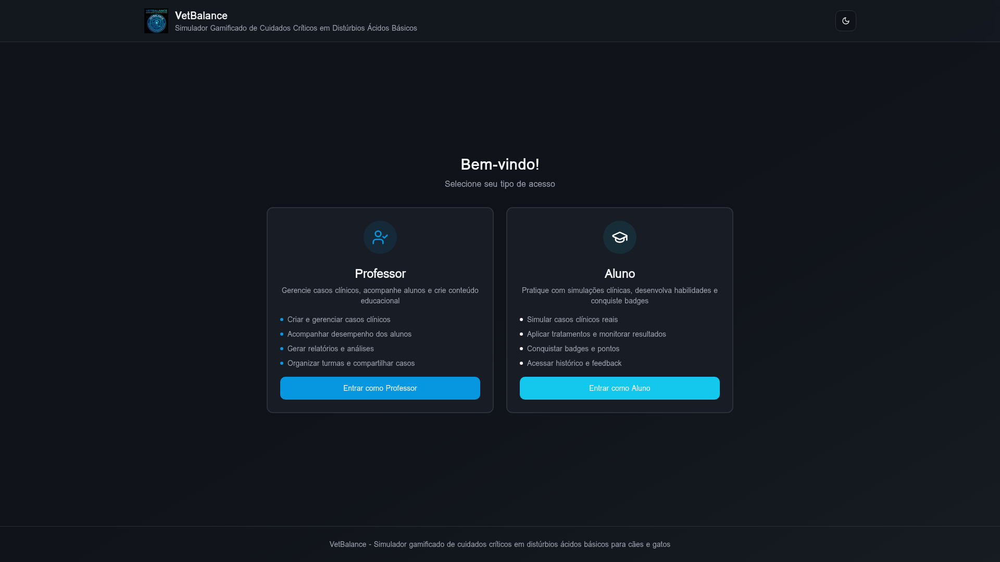

**Elementos identificados:**
- Logo VetBalance com identidade visual do sistema
- Dois cards de seleção: "👨‍🏫 Professor" e "👨‍🎓 Aluno"
- Descrição das funcionalidades de cada papel
- Botões de acesso que redirecionam para os formulários de autenticação correspondentes
- Toggle de tema claro/escuro
- Design responsivo com paleta de cores institucional

**Finalidade educacional:** Permite a segregação clara de papéis, garantindo que professores e alunos acessem funcionalidades adequadas ao seu perfil.

---

### Tela 2 – Login/Cadastro do Aluno

**Rota:** `/auth/aluno`  
**Descrição:** Formulário de autenticação para estudantes.

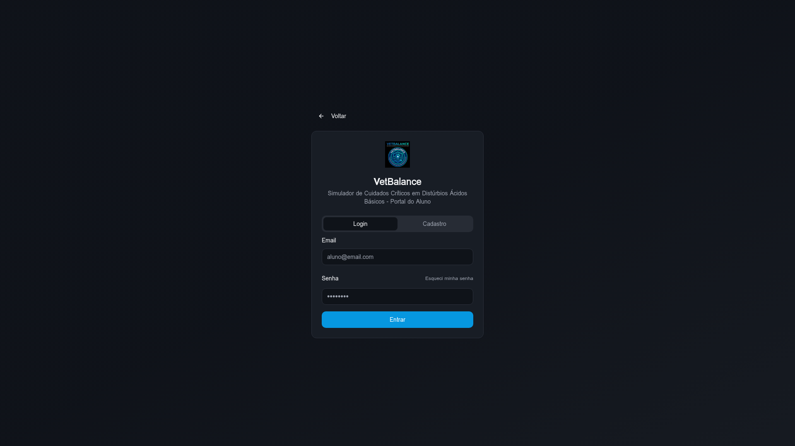

**Elementos identificados:**
- Logo VetBalance
- Formulário com campos: Nome Completo, E-mail, Senha
- Alternância entre modo "Entrar" e "Cadastrar"
- Validação de campos em tempo real
- Link para recuperação de senha
- Botão "Voltar" para retornar à seleção de papel

**Segurança:** Verificação de e-mail obrigatória antes do primeiro acesso.

---

### Tela 3 – Login/Cadastro do Professor

**Rota:** `/auth/professor`  
**Descrição:** Formulário de autenticação para professores com campo adicional de chave de acesso.

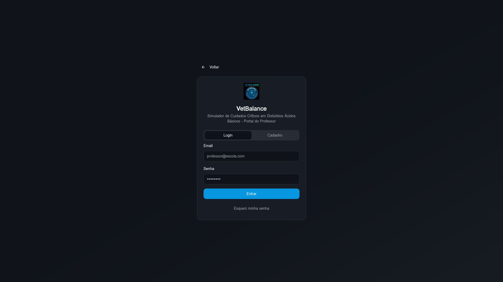

**Elementos identificados:**
- Formulário com campos: Nome Completo, E-mail, Senha, **Chave de Acesso**
- Campo exclusivo de chave de acesso institucional (obrigatório no cadastro)
- Validação da chave contra o banco de dados (`professor_access_keys`)
- Mesma alternância entre modos de login e cadastro

**Segurança:** A chave de acesso garante que apenas professores autorizados pela instituição possam se registrar como docentes no sistema.

---

### Tela 4 – Dashboard do Aluno (Simulador)

**Rota:** `/app` (requer autenticação como aluno)  
**Descrição:** Interface principal do simulador com todas as ferramentas de simulação.

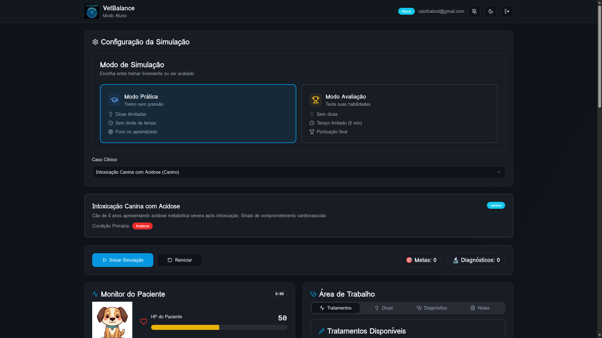

**Elementos esperados:**
- **Seletor de caso clínico** (dropdown com casos disponíveis)
- **Monitor de parâmetros** em tempo real (pH, PaO₂, PaCO₂, FC, PA, etc.)
- **Barra de HP** do paciente virtual (0-100) com cores dinâmicas
- **Mascote animado** (cão/gato com expressão baseada no HP)
- **Painel de tratamentos** com botões para cada terapia disponível
- **Controles de simulação:** Iniciar, Pausar, Resetar
- **Timer** com contagem regressiva (limite de 5 minutos)
- **Abas:** Simulação, Diagnóstico, Notas, Badges, Ranking, Histórico, Evolução
- **Gráficos** de evolução temporal dos parâmetros (Recharts)
- **Modo de simulação:** Prática (com dicas) ou Avaliação (sem dicas)
- **Feedback visual:** Cores verdes para tratamentos adequados, vermelhas para inadequados

---

### Tela 5 – Monitor de Parâmetros em Tempo Real

**Rota:** `/app` (durante simulação ativa)  
**Descrição:** Visualização detalhada dos parâmetros fisiológicos do paciente.

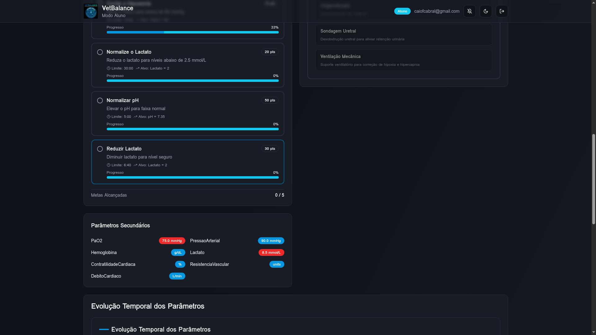

**Elementos identificados:**
- Cards individuais para cada parâmetro com:
  - Nome do parâmetro e unidade
  - Valor atual em destaque
  - Indicador de tendência (↑ subindo, ↓ descendo, → estável)
  - Faixa normal de referência
  - Cor de alerta (verde=normal, amarelo=atenção, vermelho=crítico)
- Gráfico de linha temporal mostrando evolução de cada parâmetro
- Alertas sonoros para parâmetros fora da faixa normal

---

### Tela 6 – Painel de Tratamentos

**Rota:** `/app` (durante simulação ativa)  
**Descrição:** Interface de seleção e aplicação de tratamentos.

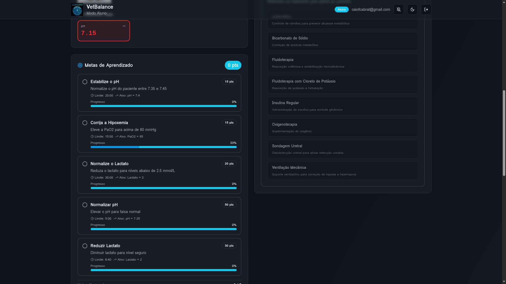

**Elementos identificados:**
- Lista de 8 tratamentos disponíveis organizados por tipo:
  - Alcalinizante: Bicarbonato de Sódio
  - Suporte Respiratório: Oxigenoterapia
  - Suporte Circulatório: Fluidoterapia
  - Respiratório: Ventilação Mecânica
  - Medicamentos: Insulina Regular, Antiemético
  - Procedimento: Sondagem Uretral
  - Fluido: Fluidoterapia com KCl
- Botões de aplicação com ícones
- Feedback imediato: variação do HP (+25, +15, +10, ou -15)
- Indicação visual do efeito (positivo em verde, negativo em vermelho)

---

### Tela 7 – Sistema de Badges

**Rota:** `/app` (aba "Badges")  
**Descrição:** Visualização das conquistas do aluno.

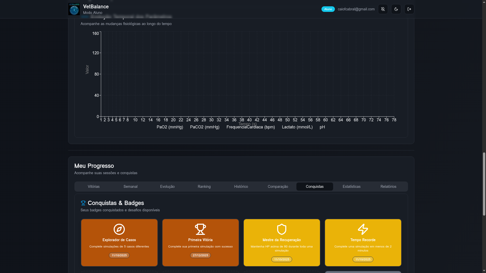

**Elementos identificados:**
- Grid de 17 badges organizados por categoria (Bronze, Prata, Ouro, Streaks, Milestones, Performance, Ranking)
- Badges conquistados com cor vibrante e data de conquista
- Badges não conquistados em cinza/opaco com critério de desbloqueio
- Animação de confetti ao conquistar novo badge
- Contagem de badges: conquistados/total

---

### Tela 8 – Ranking Semanal

**Rota:** `/app` (aba "Semanal")  
**Descrição:** Leaderboard com posições semanais e reset automático.

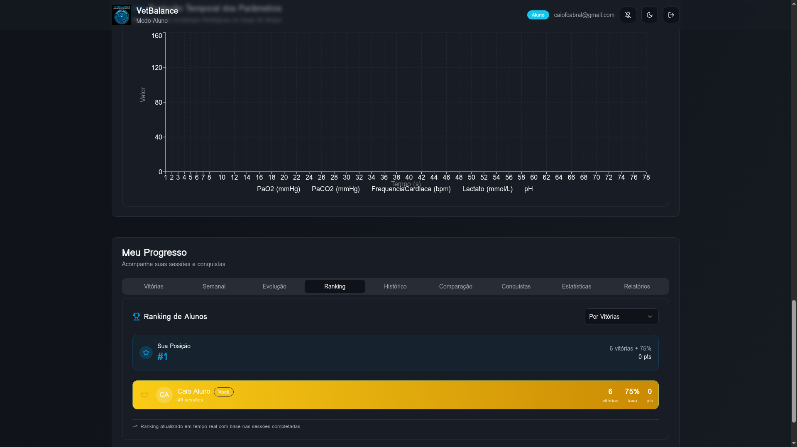

**Elementos identificados:**
- Tabela/lista de posições dos alunos
- Colunas: Posição, Nome, Vitórias, Pontos, Taxa de Sucesso
- Destaque para top 3 (ouro, prata, bronze)
- Indicador de período da semana atual
- Posição do aluno logado em destaque
- Atualização em tempo real via WebSocket

---

### Tela 9 – Histórico de Evolução no Ranking

**Rota:** `/app` (aba "Evolução")  
**Descrição:** Gráfico de evolução do aluno ao longo das semanas.

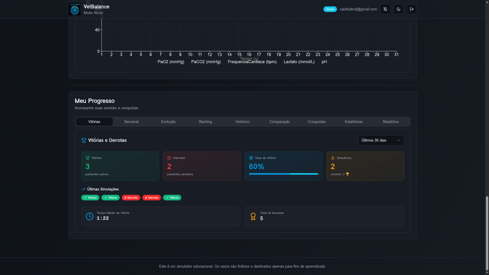

**Elementos identificados:**
- Gráfico de linha com eixo X = semanas, eixo Y = posição no ranking
- Lista de registros semanais com: posição, vitórias, sessões, pontos, taxa
- Resumo da performance geral

---

### Tela 10 – Dashboard do Professor

**Rota:** `/professor` (requer autenticação como professor)  
**Descrição:** Painel de gerenciamento para professores.

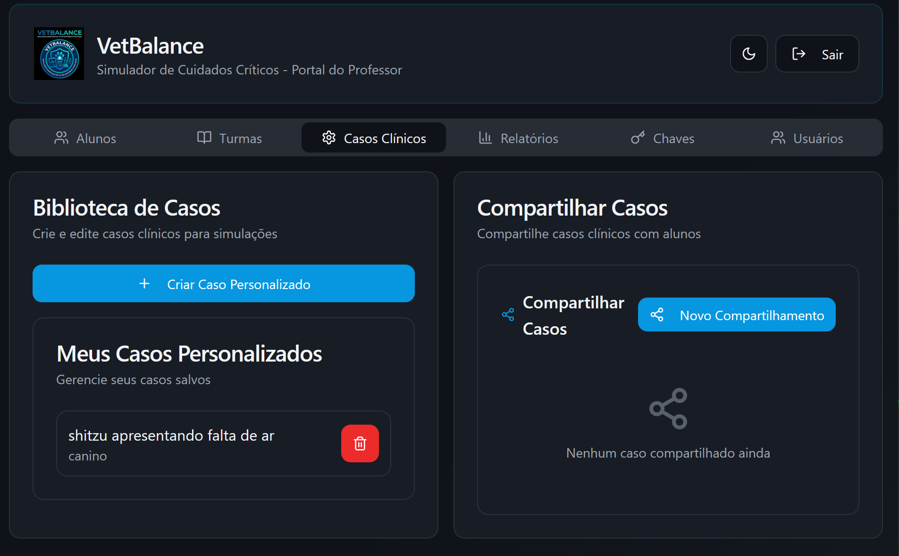

**Elementos identificados:**
- **Gerenciador de Casos:** Criar, editar, deletar casos clínicos
- **CaseDataPopulator:** Geração automática de dados via IA
- **Compartilhamento:** Geração de códigos de acesso para alunos
- **Biblioteca de Casos:** Visualização de todos os casos criados
- **Gerenciamento de Turmas:** Criação e administração de turmas
- **Gerenciamento de Alunos:** Vínculo professor-aluno por e-mail
- **Relatórios:** Estatísticas individuais e por turma
- **Ranking de Alunos:** Visualização de desempenho comparativo
- **Chaves de Acesso:** Geração de chaves para novos professores

---

### Tela 11 – Resultado de Simulação (Vitória)

**Descrição:** Tela exibida quando o aluno estabiliza o paciente (HP ≥ 100).

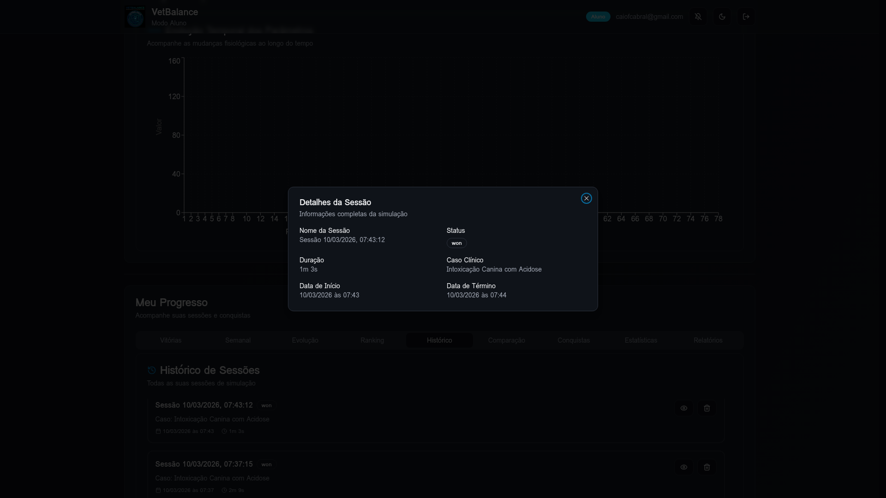

**Elementos identificados:**
- Mascote do paciente com expressão de vitória
- Animação de confetti (canvas-confetti)
- Mensagem: "Paciente Estabilizado!"
- Resumo: duração, tratamentos aplicados, HP final
- Botões: Ver Feedback (IA), Exportar Relatório, Nova Simulação
- Badge notification (se aplicável)

---

### Tela 12 – Resultado de Simulação (Derrota)

**Descrição:** Tela exibida quando HP chega a zero ou tempo esgota.

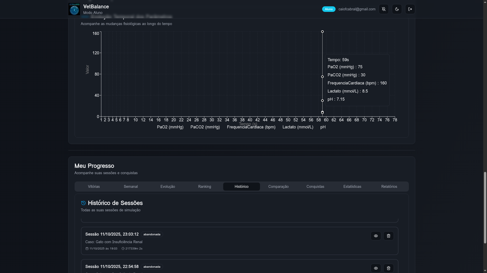

**Elementos identificados:**
- Mascote com expressão triste/falecido
- Mensagem: "Paciente Faleceu" ou "Tempo Esgotado"
- Resumo do que aconteceu
- Sugestões de melhoria
- Botão para tentar novamente

---

### Repositório das Capturas de Tela

Todas as 12 capturas de tela estão disponíveis no repositório GitHub:  
📁 [`docs/screenshots/`](https://github.com/KyoFaBraL/vet-sim-buddy/tree/main/docs/screenshots)

| Arquivo | Tela |
|---------|------|
| `01-role-selection.png` | Seleção de Papel (Tela Inicial) |
| `02-auth-aluno.png` | Login/Cadastro do Aluno |
| `03-auth-professor.png` | Login/Cadastro do Professor |
| `04-dashboard-aluno.png` | Dashboard do Aluno (Simulador) |
| `05-monitor-parametros.png` | Monitor de Parâmetros |
| `06-painel-tratamentos.png` | Painel de Tratamentos |
| `07-sistema-badges.png` | Sistema de Badges |
| `08-ranking-semanal.png` | Ranking Semanal |
| `09-historico-evolucao.png` | Histórico de Evolução |
| `10-dashboard-professor.png` | Dashboard do Professor |
| `11-resultado-vitoria.png` | Resultado – Vitória |
| `12-resultado-derrota.png` | Resultado – Derrota |

---

## 22. CRONOGRAMA DE VALIDAÇÃO

O processo de validação do VetBalance está formalizado no documento **VETBALANCE-PVS-001 — Plano de Validação de Software**, elaborado conforme as normas IEEE 829-2008, ISO/IEC 25010:2011 e NBR ISO/IEC 12207:2009.

### 22.1 Dados Gerais

| Item | Valor |
|------|-------|
| **Identificador do documento** | VETBALANCE-PVS-001 v1.0 |
| **Tipo de estudo** | Quase-experimental, controlado, com pré e pós-teste |
| **Data de início** | 10/03/2026 |
| **Data de término** | 31/07/2026 |
| **Duração total** | ~5 meses (20 semanas) |
| **Agosto/2026** | Reservado para redação e defesa do mestrado |

### 22.2 Fases do Cronograma

| Fase | Semanas | Período | Duração | Atividades Principais |
|------|---------|---------|---------|----------------------|
| **F1 — Preparação** | 1–3 | 10/03 – 28/03/2026 | 19 dias | Submissão CEP, apresentação aos docentes, cadastro e randomização GE/GC, pré-teste diagnóstico (O₁) |
| **F2 — Intervenção Inicial** | 4–6 | 30/03 – 18/04/2026 | 20 dias | Aulas teóricas partes 1 e 2 (GE + GC), treinamento no SUT (tutorial guiado), uso supervisionado GE (acidose/alcalose metabólica) |
| **F3 — Avaliação Intermediária 1** | 7–9 | 27/04 – 16/05/2026 | 20 dias | Uso intensivo do SUT pelo GE, atividades tradicionais GC, avaliação intermediária 1 (O₂ — distúrbios metabólicos), análise parcial em RStudio |
| **F4 — Intervenção Avançada** | 10–12 | 18/05 – 06/06/2026 | 20 dias | Casos avançados (cetoacidose diabética, hipercapnia, mistos), aulas sobre compensação e protocolos terapêuticos, modo avaliação do SUT (sem dicas de IA) |
| **F5 — Avaliação Final e Coleta** | 13–15 | 08/06 – 27/06/2026 | 20 dias | Revisão geral no SUT, avaliação intermediária 2 (O₃ — distúrbios respiratórios e mistos), questionário SUS adaptado, pós-teste final (O₄), exportação completa dos dados (CSV/TXT) |
| **F6 — Análise e Relatório** | 17–20 | 30/06 – 31/07/2026 | 32 dias | Processamento estatístico (testes t de Student, Shapiro-Wilk), análise de dados do SUT (sessões, win rate, badges, d de Cohen), cruzamento software × notas (correlação de Pearson), redação e entrega do relatório final IEEE 829 |

### 22.3 Marcos Críticos (Milestones)

| Marco | Data | Descrição |
|-------|------|-----------|
| 🔴 O₁ | 24/03 – 28/03/2026 | Pré-teste diagnóstico (GE + GC) |
| 🔴 O₂ | 11/05 – 14/05/2026 | Avaliação intermediária 1 — distúrbios metabólicos |
| 🔴 O₃ | 14/06 – 16/06/2026 | Avaliação intermediária 2 — distúrbios respiratórios e mistos |
| 🔴 O₄ | 20/06 – 23/06/2026 | Pós-teste final — avaliação abrangente |
| ✅ Coleta | 27/06/2026 | Encerramento da coleta de dados |
| ✅ Relatório | 31/07/2026 | Entrega do relatório final de validação (IEEE 829) |
| 🎓 Defesa | Agosto/2026 | Redação da dissertação e defesa do mestrado |

### 22.4 Funcionalidades Sob Validação

| ID | Funcionalidade | Módulo de Referência |
|----|---------------|----------------------|
| F-01 | Simulação de casos clínicos em tempo real | `useSimulation.ts` |
| F-02 | Sistema de HP e deterioração temporal | `HPDisplay.tsx` |
| F-03 | Aplicação e validação de tratamentos | `TreatmentPanel.tsx` |
| F-04 | Monitoramento de 10 parâmetros fisiológicos | `PatientMonitor.tsx` |
| F-05 | Sistema de badges e conquistas (17 badges) | `BadgeSystem.tsx` |
| F-06 | Ranking semanal com reset automático | `WeeklyLeaderboard.tsx` |
| F-07 | Feedback de sessão via IA | `generate-session-feedback` |
| F-08 | Modo Prática vs. Modo Avaliação | `SimulationModeSelector.tsx` |
| F-09 | Exportação de relatórios (CSV/TXT) | `ReportPanel.tsx` |
| F-10 | Histórico e replay de sessões | `SessionHistory.tsx`, `SessionReplay.tsx` |

### 22.5 Critérios de Aceitação Resumidos

| Critério | Métrica | Valor Alvo |
|----------|---------|------------|
| Ganho de aprendizagem GE | Δ(pós − pré-teste) | > 0 com p < 0,05 |
| Superioridade GE sobre GC | Diferença de médias | p < 0,05 (teste t) |
| Tamanho do efeito | d de Cohen | d ≥ 0,8 |
| Correlação software × desempenho | r de Pearson | r ≥ 0,3 com p < 0,05 |
| Satisfação do usuário | Questionário SUS | Média ≥ 4,0/5,0 |
| Disponibilidade do SUT | Uptime | ≥ 99% |

> **Documento completo:** Consultar `CRONOGRAMA_VALIDACAO.md` (VETBALANCE-PVS-001 v1.0)

### 22.6 Instrumentos de Coleta de Dados

#### 22.6.1 Instrumentos Aplicados pelo Pesquisador

| ID | Instrumento | Momento | Amostra | Formato | Referência |
|----|-------------|---------|---------|---------|------------|
| I-01 | Pré-teste diagnóstico | 24/03 – 28/03/2026 (O₁) | GE + GC | 20 objetivas + 3 discursivas (0–10) | PROTOCOLO_CEP.md, Apêndice A |
| I-02 | Avaliação intermediária 1 | 11/05 – 14/05/2026 (O₂) | GE + GC | Prova teórico-prática (0–10) | — |
| I-03 | Avaliação intermediária 2 | 14/06 – 16/06/2026 (O₃) | GE + GC | Prova teórico-prática (0–10) | — |
| I-04 | Pós-teste final | 20/06 – 23/06/2026 (O₄) | GE + GC | 20 objetivas + 3 discursivas (0–10) | PROTOCOLO_CEP.md, Apêndice A |
| I-05 | Questionário de satisfação | 17/06 – 19/06/2026 | GE apenas | Escala Likert 5 pontos (SUS adaptado) | PROTOCOLO_CEP.md, Apêndice B |

#### 22.6.2 Dados Coletados Automaticamente pelo SUT

| ID | Dado | Tabela no Banco | Tipo | Granularidade |
|----|------|-----------------|------|---------------|
| D-01 | Sessões de simulação | `simulation_sessions` | Quantitativo | Por sessão |
| D-02 | Snapshots de parâmetros | `session_history` | Quantitativo | Por tick (1s) |
| D-03 | Decisões clínicas | `session_decisions` | Qualitativo/Quantitativo | Por evento |
| D-04 | Tratamentos aplicados | `session_treatments` | Quantitativo | Por evento |
| D-05 | Badges conquistados | `user_badges` | Quantitativo | Por conquista |
| D-06 | Ranking semanal | `weekly_ranking_history` | Quantitativo | Semanal |
| D-07 | Notas de simulação | `simulation_notes` | Qualitativo | Por anotação |

---

### 22.7 Checklist de Pré-Validação (antes de 10/03/2026)

Este checklist deve ser executado **integralmente** antes do início da Fase F1 (10/03/2026) para garantir que todas as funcionalidades sob teste estejam operacionais em ambiente de produção.

#### 22.7.1 Funcionalidades do Simulador (F-01 a F-10)

| # | ID | Funcionalidade | Módulo | Critério de Aceite | Status |
|---|-----|---------------|--------|-------------------|--------|
| 1 | F-01 | Simulação de casos clínicos em tempo real | `useSimulation.ts` | Iniciar, pausar e reiniciar simulação nos 7 casos pré-definidos; tick de 1s registrado em `session_history` | ☐ |
| 2 | F-02 | Sistema de HP e deterioração temporal | `HPDisplay.tsx` | HP inicia em 50, decai -1/5s; vitória em HP ≥ 100; derrota em HP ≤ 0 ou tempo > 5min | ☐ |
| 3 | F-03 | Aplicação e validação de tratamentos | `TreatmentPanel.tsx` | 8 tratamentos disponíveis; validação contra gabarito (`tratamentos_adequados`/`tratamentos_caso`); HP +10~+25 (adequado) ou -15 (inadequado) | ☐ |
| 4 | F-04 | Monitoramento de 10 parâmetros fisiológicos | `PatientMonitor.tsx` | pH, PaO₂, PaCO₂, FC, FR, Temp, HCO₃, Lactato, PA, Hb exibidos em tempo real com atualização a cada tick | ☐ |
| 5 | F-05 | Sistema de badges e conquistas | `BadgeSystem.tsx` | 17 badges em 5 categorias (Bronze, Prata, Ouro, Streaks, Milestones) desbloqueáveis e persistidos em `user_badges` | ☐ |
| 6 | F-06 | Ranking semanal com reset automático | `WeeklyLeaderboard.tsx` | Ranking exibido; reset às segundas-feiras; histórico persistido em `weekly_ranking_history` | ☐ |
| 7 | F-07 | Feedback de sessão via IA | `generate-session-feedback` | Edge Function responde com feedback personalizado ao final de cada sessão (modo Prática) | ☐ |
| 8 | F-08 | Modo Prática vs. Modo Avaliação | `SimulationModeSelector.tsx` | Modo Prática: dicas de IA habilitadas; Modo Avaliação: dicas desabilitadas, sem feedback intermediário | ☐ |
| 9 | F-09 | Exportação de relatórios (CSV/TXT) | `ReportPanel.tsx` | Exportação gera arquivo válido com dados de sessão, tratamentos e parâmetros; download funcional em desktop e mobile | ☐ |
| 10 | F-10 | Histórico e replay de sessões | `SessionHistory.tsx`, `SessionReplay.tsx` | Sessões anteriores listadas; replay reproduz snapshots de parâmetros em ordem cronológica | ☐ |

#### 22.7.2 Infraestrutura e Backend

| # | Item | Critério de Aceite | Status |
|---|------|-------------------|--------|
| 11 | Banco de dados em produção | 32 tabelas com RLS habilitado; dados de seed (7 casos, 9 condições, 10 parâmetros, 8 tratamentos, 17 badges) presentes | ☐ |
| 12 | 9 Edge Functions operacionais | `analyze-custom-case`, `autofix-case`, `generate-differential-diagnosis`, `generate-random-case`, `generate-session-feedback`, `populate-case-data`, `treatment-hints`, `update-case-data`, `validate-case-acidbase` — todas retornam HTTP 200 com JWT válido | ☐ |
| 13 | Autenticação e papéis | Registro de aluno (sem chave) e professor (com chave institucional) funcional; `has_role()` retorna papel correto | ☐ |
| 14 | Chaves de acesso de professor | Validação via `validate_professor_access_key()` funcional; chaves expiradas/usadas rejeitadas | ☐ |
| 15 | Persistência de sessões | `simulation_sessions`, `session_history`, `session_decisions`, `session_treatments` recebem dados corretamente durante simulação | ☐ |

#### 22.7.3 Interface e Usabilidade

| # | Item | Critério de Aceite | Status |
|---|------|-------------------|--------|
| 16 | Responsividade mobile | Interface funcional em Chrome/Safari mobile (≥ 360px de largura) | ☐ |
| 17 | Tema claro/escuro | Alternância funcional sem quebra visual | ☐ |
| 18 | Tempo de resposta | Ações do usuário (aplicar tratamento, navegar entre abas) respondem em < 2s | ☐ |
| 19 | Dashboard do professor | Gerenciamento de turmas, relatórios por aluno, criação de casos personalizados e compartilhamento via código de acesso operacionais | ☐ |
| 20 | Coleta automática de dados (D-01 a D-07) | Todas as 7 categorias de dados registradas corretamente no banco durante uma sessão de teste completa | ☐ |

#### 22.7.4 Procedimento de Execução

1. **Responsável:** Pesquisador principal
2. **Prazo:** Concluir até **07/03/2026** (3 dias antes do início de F1)
3. **Ambiente:** Produção (https://vetbalance.app.br)
4. **Método:** Executar cada item com conta de aluno-teste e conta de professor-teste
5. **Registro:** Marcar status (✅ Aprovado / ❌ Falha) e documentar evidências (screenshots ou logs)
6. **Critério de aprovação:** 100% dos itens aprovados (20/20)
7. **Contingência:** Itens reprovados devem ser corrigidos e retestados antes de 10/03/2026

---

## CONSIDERAÇÕES FINAIS

O VetBalance representa uma solução tecnológica completa para o ensino de equilíbrio ácido-base em medicina veterinária, integrando:

1. **Simulação em tempo real** com motor de tick-based e persistência completa
2. **Gamificação multicamada** com HP, badges, rankings e animações
3. **Inteligência Artificial** para geração de conteúdo e feedback personalizado
4. **Segurança robusta** com RLS em todas as tabelas e autenticação por papel
5. **Multiplataforma** (Web + Android) via Capacitor
6. **Ferramentas docentes** completas para criação, compartilhamento e análise
7. **Rastreabilidade total** de decisões, tratamentos e evolução de parâmetros

O sistema está funcional e disponível em produção em https://vetbalance.app.br, pronto para validação com grupos experimentais conforme metodologia proposta.

---

---

## REFERÊNCIAS CRUZADAS — DOCUMENTAÇÃO DO PROJETO

| Documento | Identificador | Conteúdo | Seções Relacionadas |
|-----------|---------------|----------|---------------------|
| `DOCUMENTACAO_SOFTWARE.md` | — (este documento) | Documentação técnica completa (22 seções) | Seção 22 → Validação |
| `CRONOGRAMA_VALIDACAO.md` | VETBALANCE-PVS-001 v1.0 | Plano de Validação de Software (IEEE 829) | Seções 8–9 (Procedimentos e Cronograma) ↔ Seção 22 deste documento |
| `ARTIGO_RESUMO_EXPANDIDO.md` | — | Resumo expandido para publicação acadêmica | Material e Métodos ↔ Seção 22 deste documento; Seções 5, 10, 12 do PVS-001 |
| `RESUMO_EXECUTIVO.md` | — | Resumo executivo para banca/orientador | Seção 6 (Validação) ↔ Seção 22 deste documento; Seção 9 do PVS-001 |
| `DIAGRAMAS_MERMAID.md` | — | 10 diagramas visuais da arquitetura | Arquitetura ↔ Seções 3–7 deste documento |
| `PERMISSIONS_GUIDE.md` | — | Guia de permissões e políticas RLS | Segurança ↔ Seção 17 deste documento |
| `GLOSSARIO.md` | — | Glossário unificado (43 termos, 5 categorias) | Seção 21 deste documento; Seção 4 do PVS-001 |
| `cronograma-validacao-vetbalance.csv` | — | Dados tabulares do cronograma (importável) | Espelho das Seções 8–10 do PVS-001 |
| `PROTOCOLO_CEP.md` | VETBALANCE-CEP-001 | Protocolo para submissão ao CEP (21 seções + TCLE + termos) | Seção 22 deste documento; Seções 5, 8–12 do PVS-001 |
| `METRICAS_PROJETO.md` | — | Métricas consolidadas do projeto (32 tabelas, 9 funções, 99 componentes, performance) | Referência rápida para defesa ↔ Seções 2–8, 17 deste documento |

### Matriz de Rastreabilidade entre Documentos

| Elemento | DOCUMENTACAO_SOFTWARE.md | CRONOGRAMA_VALIDACAO.md | ARTIGO_RESUMO_EXPANDIDO.md | RESUMO_EXECUTIVO.md |
|----------|--------------------------|-------------------------|----------------------------|---------------------|
| Fases F1–F6 | Seção 22.2 | Seções 8.1–8.6, 9.1–9.2 | Material e Métodos (§3) | Seção 6 (tabela) |
| Marcos O₁–O₄ | Seção 22.3 | Seção 9.3 | Material e Métodos (§3) | Seção 6 (Marcos Críticos) |
| Instrumentos I-01 a I-05 | Seção 22.6.1 | Seção 10.1 | — | — |
| Dados automáticos D-01 a D-07 | Seção 22.6.2 | Seção 10.2 | Material e Métodos (§3) | — |
| Funcionalidades F-01 a F-10 | Seção 22.4 | Seção 2.2 | — | Seção 2 |
| Critérios de aceitação | Seção 22.5 | Seção 6 | Material e Métodos (§3) | Seção 6 (Análise) |
| Análise estatística | Seção 22.5 | Seção 12 | Material e Métodos (§3) | Seção 6 (último §) |
| Evidências visuais | Seção 21 | — | Evidências Visuais | Seção 8 |
| Checklist pré-validação (20 itens) | Seção 22.7 | Anexo A (A.1–A.4) | — | — |
| Protocolo CEP | — | Seções 5, 15 | — | — |

---

**Documento gerado em:** Fevereiro de 2026  
**Versão do documento:** 1.0  
**Total de componentes:** 60+ componentes React  
**Total de tabelas:** 32 tabelas PostgreSQL  
**Total de Edge Functions:** 9 funções serverless  
**Total de linhas de código:** ~15.000+ linhas TypeScript/TSX  
**Total de capturas de tela:** 12 telas documentadas com evidências visuais
